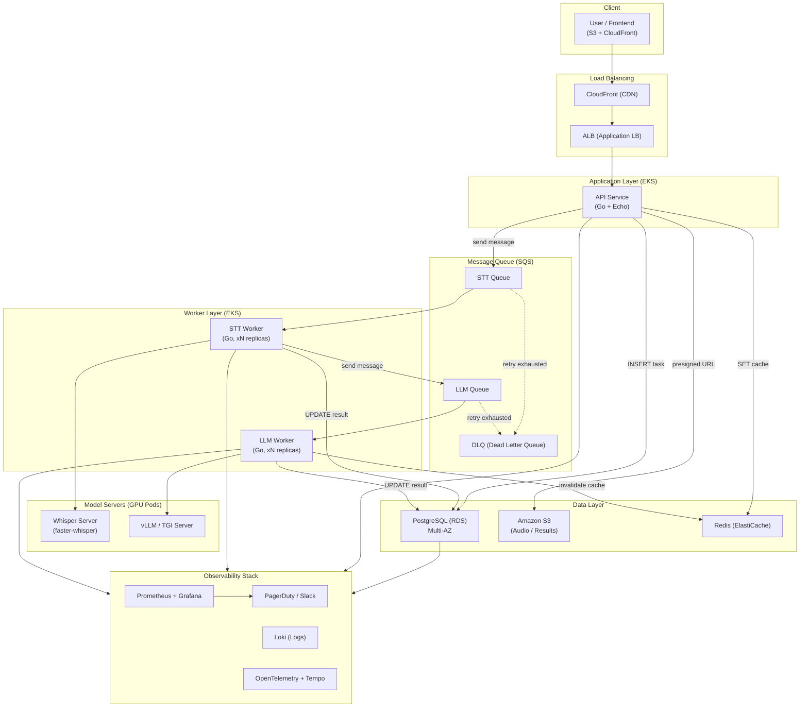
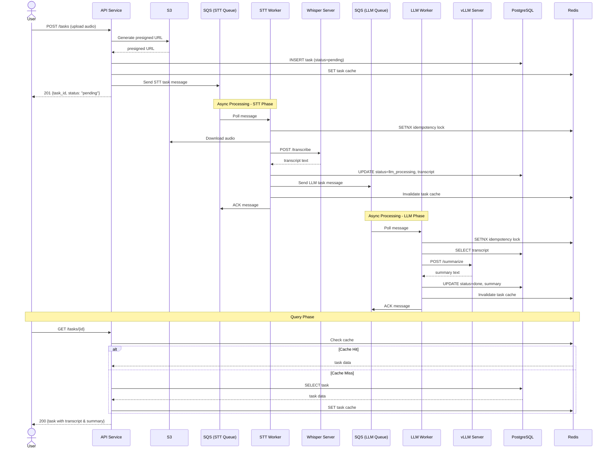
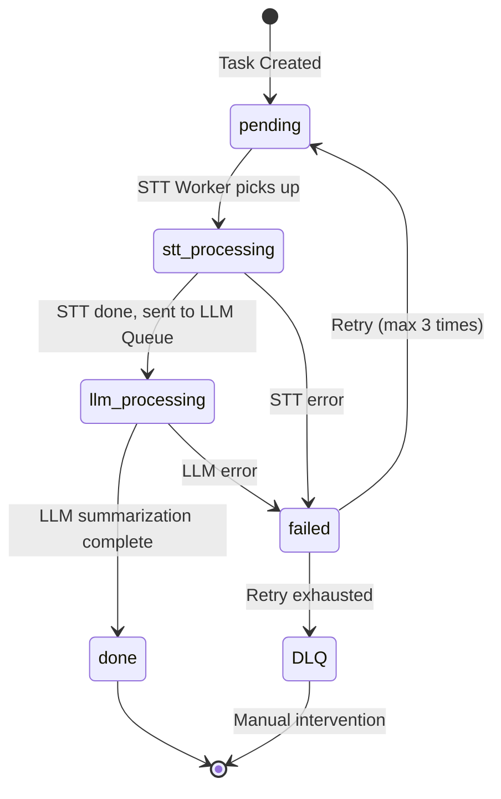
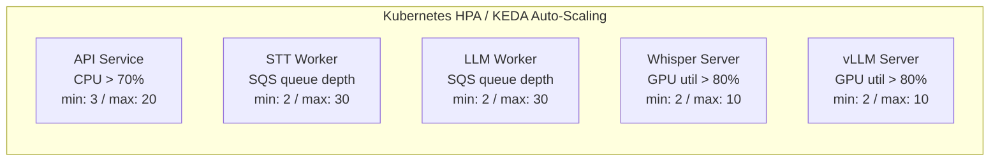
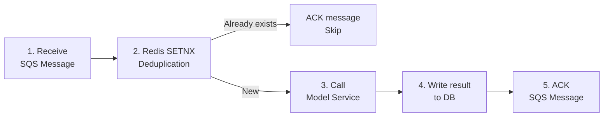
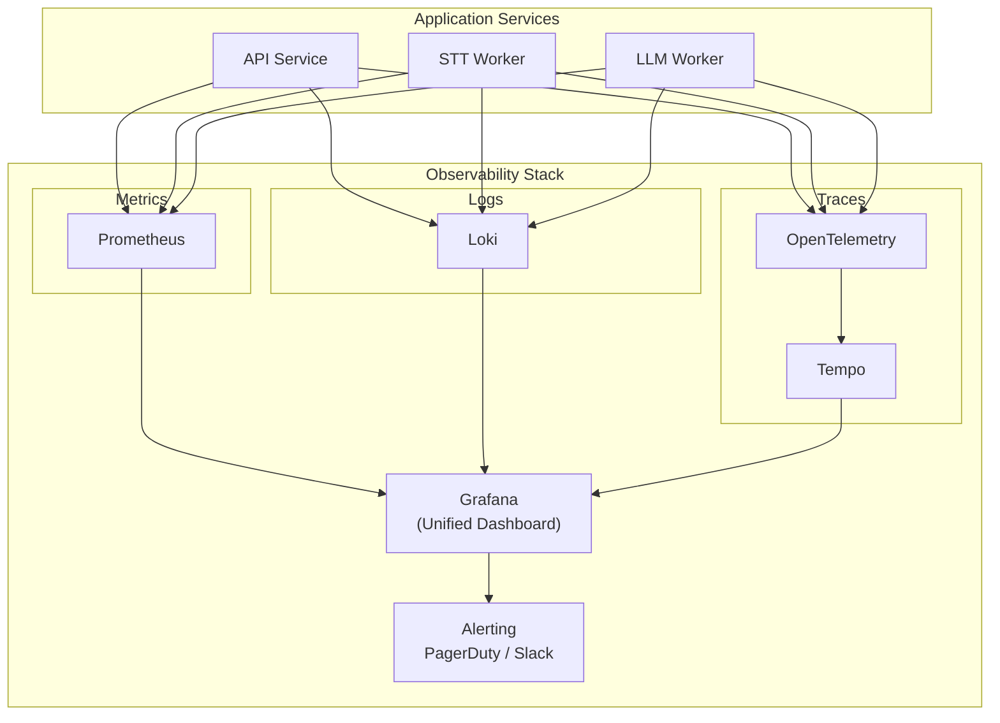
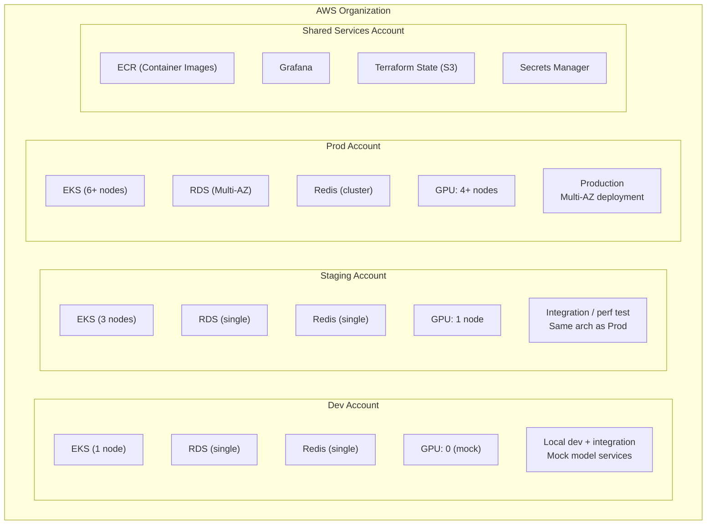
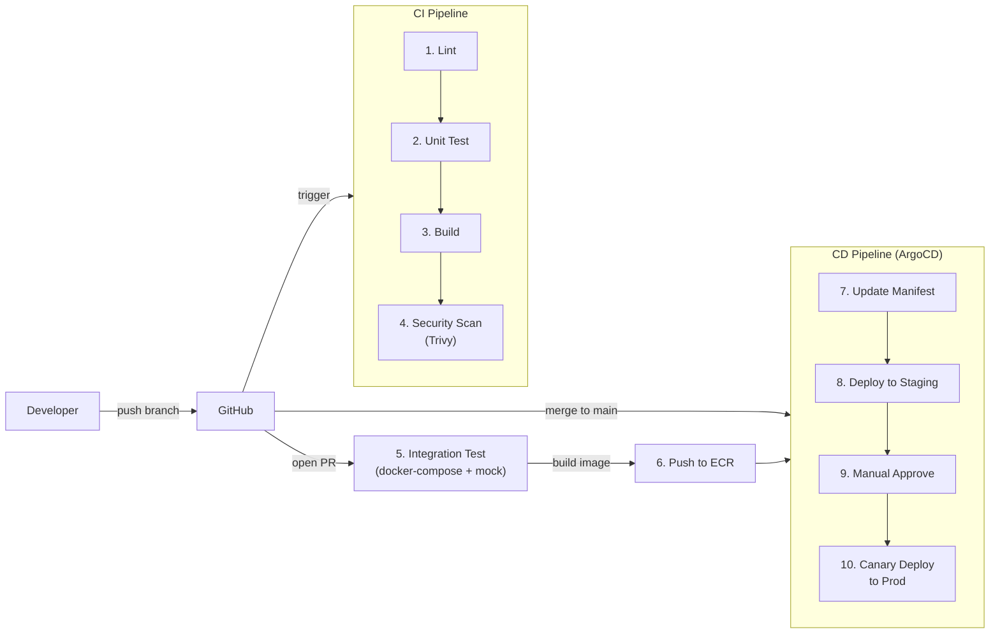

# AI Processing Platform — System Architecture Design

## 1. Overview

本平台是一個可擴充、可維運的 AI 任務處理系統，整合語音轉文字（STT）與文字摘要（LLM）兩大 AI 能力。使用者上傳音訊檔案後，系統透過事件驅動的微服務架構，依序進行語音轉文字與 LLM 摘要處理，最終將結果儲存供查詢。架構設計支援 2000+ 並發任務，採用 Go 語言開發全部服務，搭配 AWS 雲端服務（EKS、SQS、S3、RDS、ElastiCache）與 Kubernetes 容器編排，實現水平自動擴展、容錯重試與全鏈路可觀測性。

---

## 2. System Architecture



### Service Responsibilities

| Service | Language / Tech | Responsibilities |
|---------|----------------|-----------------|
| **API Service** | Go (Echo) | 接收上傳、建立任務、查詢結果、WebSocket 通知 |
| **STT Worker** | Go | 消費 STT Queue，調用 Whisper Server API，回寫結果並發送到 LLM Queue |
| **LLM Worker** | Go | 消費 LLM Queue，調用 vLLM/TGI API，回寫最終摘要結果 |
| **Whisper Server** | faster-whisper (Container) | GPU Pod，提供 REST API 做語音轉文字 |
| **vLLM / TGI** | vLLM (Container) | GPU Pod，提供 REST API 做文字摘要 |
| **PostgreSQL (RDS)** | - | 任務元資料、狀態、結果文字 |
| **S3** | - | 原始音訊檔、大型結果檔案 |
| **Redis (ElastiCache)** | - | 任務狀態快取、rate limiting、冪等性檢查 |
| **SQS** | - | STT Queue + LLM Queue + DLQ，解耦任務、支持重試 |

---

## 3. Task Flow



### Data Flow Summary

| Step | Action | Data Store |
|------|--------|-----------|
| 1 | 使用者上傳音訊 | S3 (presigned URL 直傳，不經 API Server) |
| 2 | API Service 建立任務記錄 | PostgreSQL `tasks` 表 (status=pending) |
| 3 | 發送 STT 任務訊息 | SQS STT Queue |
| 4 | STT Worker 下載音訊、調用 Whisper | S3 → Whisper Server |
| 5 | 轉寫文字結果回寫 | PostgreSQL (transcript 欄位) |
| 6 | 發送 LLM 任務訊息 | SQS LLM Queue |
| 7 | LLM Worker 讀取 transcript、調用 vLLM | PostgreSQL → vLLM Server |
| 8 | 摘要結果回寫 | PostgreSQL (summary 欄位, status=done) |
| 9 | 使用者查詢結果 | Redis cache → PostgreSQL fallback |

---

## 4. Task State Machine



### Key Design Decisions

- **S3 Presigned URL 直傳** -- 音訊檔可能很大，避免經過 API Server 消耗頻寬和記憶體
- **Two-stage Queue** -- STT 和 LLM 分開排隊，允許各自獨立擴展和重試
- **DLQ (Dead Letter Queue)** -- 重試超過 3 次的失敗任務進入 DLQ，觸發告警人工處理
- **Idempotency** -- Worker 用 Redis 記錄已處理的 message ID，避免重複處理

---

## 5. Technology Selection

### Language & Framework

| Technology | Choice | Rationale |
|-----------|--------|-----------|
| **API Service** | Go + Echo | Echo 輕量高效能，middleware 生態成熟（auth、CORS、rate limit），適合高並發 API |
| **Workers** | Go | goroutine 天然適合大量 I/O 等待（等 Whisper/vLLM 回應），記憶體佔用低，單 Pod 可處理大量並發任務 |
| **Frontend** | React + TypeScript | 主流框架，用 Vite 建構，題目重點不在前端 |

### Cloud Services (AWS)

| Requirement | AWS Service | Rationale |
|-------------|------------|-----------|
| **Container Orchestration** | EKS (Kubernetes) | 支持 GPU node group、HPA 自動擴展、與 AWS 深度整合 |
| **Message Queue** | SQS | 全託管、天然支持 DLQ 和 visibility timeout、不需維運 broker |
| **Object Storage** | S3 | 音訊檔存放，搭配 presigned URL 直傳，lifecycle policy 自動清理 |
| **RDBMS** | RDS PostgreSQL (Multi-AZ) | ACID 保證任務狀態一致性，Multi-AZ 自動容錯切換 |
| **Cache** | ElastiCache Redis | 任務狀態快取、rate limiting、冪等性檢查 |
| **CDN** | CloudFront | 前端靜態資源加速 |
| **Load Balancer** | ALB | Layer 7 路由、支持 WebSocket（任務進度推送）|
| **DNS** | Route 53 | 健康檢查 + failover routing |

### Database / Cache / Queue Comparison

**Why SQS over Kafka or RabbitMQ?**

| Aspect | SQS | Kafka | RabbitMQ |
|--------|-----|-------|----------|
| **Ops Cost** | 全託管，零運維 | 需管理集群或用 MSK（成本高）| 需自架或用 AmazonMQ |
| **Use Case Fit** | 任務佇列（每條消息處理一次）| 事件流/日誌（需要回放）| 複雜路由（不需要）|
| **DLQ Support** | 原生內建 | 需自行實作 | 原生支持 |
| **Scalability** | 自動，無上限 | 需預設 partition 數 | 需手動擴展 |

**Conclusion**: 場景是「任務佇列」而非「事件流」，每條消息處理一次就好，SQS 最匹配且零運維。

> **Note**: 本地開發環境使用 RabbitMQ 作為 SQS 的替代品，透過 docker-compose 運行，接口模式一致。

### Model Deployment Strategy

| Model | Deployment | Detail |
|-------|-----------|--------|
| **STT (Whisper)** | Container on EKS GPU node | faster-whisper-server，g5.xlarge，提供 OpenAI-compatible API |
| **LLM (Summary)** | Container on EKS GPU node | vLLM，g5.2xlarge，支持 continuous batching 最大化 GPU 利用率 |

**Why self-hosted over AWS managed AI services (Transcribe / Bedrock)?**

| Aspect | Self-hosted Models | AWS Managed AI |
|--------|-------------------|----------------|
| **Cost** | 高並發時 GPU 實例更划算 | 按 API call 計費，2000+ 並發很貴 |
| **Latency** | 同 VPC 內調用，延遲 < 50ms | 走公網 API，延遲較高 |
| **Control** | 可調模型版本、batch size、量化 | 黑盒，無法調整 |
| **Offline** | 不依賴外部服務 | 完全依賴 AWS |

**Trade-off**: 自架需管理 GPU 節點，但在 2000+ 並發規模下成本和效能優勢明顯。若初期規模小，可先用託管服務再漸進遷移。

### Database Schema (Core)

```sql
CREATE TABLE tasks (
    id          UUID PRIMARY KEY DEFAULT gen_random_uuid(),
    status      VARCHAR(20) NOT NULL DEFAULT 'pending',
    audio_key   VARCHAR(512) NOT NULL,
    transcript  TEXT,
    summary     TEXT,
    error_msg   TEXT,
    retry_count INT DEFAULT 0,
    created_at  TIMESTAMPTZ DEFAULT NOW(),
    updated_at  TIMESTAMPTZ DEFAULT NOW()
);

CREATE INDEX idx_tasks_status ON tasks(status);
CREATE INDEX idx_tasks_created_at ON tasks(created_at);
```

---

## 6. Architecture Characteristics

### 6.1 Scalability



- **KEDA** -- 根據 SQS queue depth 自動調整 Worker 副本數
- **Cluster Autoscaler** -- Pod 無法調度時自動新增 EC2 節點
- **GPU Nodes** -- EKS managed node group + Spot Instance 降低成本（搭配 On-Demand fallback）
- **RDS Read Replica** -- 查詢流量大時加 read replica 分流

**Plug-in Task Extension:**

```go
// 新增 AI 任務只需實作 TaskProcessor 介面
type TaskProcessor interface {
    ProcessTask(ctx context.Context, task *Task) (*TaskResult, error)
    QueueName() string
}

// 註冊新處理器即可，無需改動核心邏輯
registry.Register("stt", &STTProcessor{})
registry.Register("llm", &LLMProcessor{})
registry.Register("sentiment", &SentimentProcessor{})  // 未來新增
```

### 6.2 Fault Tolerance

| Failure Scenario | Strategy |
|-----------------|----------|
| **Worker crash** | SQS visibility timeout 到期後自動重新投遞，另一個 Worker 接手 |
| **Model service unresponsive** | Worker 設定 timeout + exponential backoff 重試（最多 3 次）|
| **Retry exhausted** | 訊息進入 DLQ，觸發 CloudWatch Alarm → PagerDuty 告警 |
| **PostgreSQL primary down** | RDS Multi-AZ 自動 failover（< 60 秒）|
| **Redis down** | ElastiCache Multi-AZ，failover 自動切換；cache miss 時 fallback 到 DB |
| **Entire AZ down** | EKS Pod 分佈在多 AZ，ALB 自動繞過不健康的 AZ |
| **API Service down** | K8s liveness/readiness probe 自動重啟，ALB 健康檢查剔除不健康實例 |

**Key Mechanisms:**

- **SQS Visibility Timeout** -- 設為任務最長處理時間的 2 倍（例如 STT 任務預估 2 分鐘，timeout 設 4 分鐘）
- **Idempotent Processing** -- Worker 用 Redis `SETNX` 鎖定 task_id，確保同一任務不被重複處理
- **Circuit Breaker** -- Worker 對模型服務的調用加入熔斷器，錯誤率 > 50% 時暫停請求，避免雪崩

### 6.3 Data Consistency



- **Write-then-ACK** -- 先寫 DB，後 ACK 消息，確保結果已持久化才確認消息
- **Idempotency** -- 若 Worker 在寫 DB 後、ACK 前 crash，消息會重新投遞，但冪等機制保證不會重複寫入
- **DB Transaction** -- 狀態更新和結果寫入在同一個 transaction 內

### 6.4 Latency & Performance

| Strategy | Description |
|----------|------------|
| **Async Processing + WebSocket** | 上傳後立即回傳 task_id，透過 WebSocket 即時推送進度 |
| **S3 Presigned URL Direct Upload** | 音訊檔不經 API Server，直接傳到 S3 |
| **vLLM Continuous Batching** | 多個 LLM 請求動態批次處理，throughput 提升 3-5x |
| **Redis Result Cache** | 查詢結果命中快取時 < 5ms 回應 |
| **Connection Pooling** | Go Worker 對 DB、Redis、模型服務都維持連線池 |

**Expected Latency:**

| Phase | Latency |
|-------|---------|
| Upload → receive task_id | < 200ms |
| STT processing (1 min audio) | ~10-30s |
| LLM summarization | ~5-15s |
| Query result (cache hit) | < 50ms |

### 6.5 Security

| Layer | Measure |
|-------|---------|
| **API Auth** | JWT token（短期）+ API Key（服務間），middleware 統一驗證 |
| **S3 Access** | Presigned URL 有效期 15 分鐘，bucket policy 禁止公開存取 |
| **Transport Encryption** | 全鏈路 HTTPS/TLS，ALB 終止 TLS |
| **At-rest Encryption** | S3 SSE-S3 加密、RDS storage encryption |
| **Network Isolation** | 模型服務和 DB 在 private subnet，僅 Worker 可存取 |
| **Rate Limiting** | Redis-based sliding window，API 層限流（100 req/min per user）|
| **File Validation** | 驗證上傳檔案 MIME type 和大小上限（500MB）|
| **Secrets Management** | AWS Secrets Manager 管理 DB 密碼、API Key |

### 6.6 Observability



| Aspect | Tool | Key Metrics |
|--------|------|-------------|
| **Metrics** | Prometheus + Grafana | 任務處理速率、佇列深度、API P95/P99 延遲、GPU 利用率、錯誤率 |
| **Logs** | Loki (structured JSON log) | 每個任務的完整處理鏈路、錯誤詳情 |
| **Traces** | OpenTelemetry + Tempo | 每個任務全鏈路追蹤（API → Queue → Worker → Model），含 trace_id |
| **Alerting** | Grafana Alerting | DLQ 有消息、錯誤率 > 5%、P99 延遲 > threshold、GPU 節點不可用 |

**Task-level Tracing**: 每個 task 綁定 `trace_id`，可在 Grafana 用 task_id 一鍵查詢完整鏈路。

---

## 7. Deployment

### Deployment Topology



### CI/CD Flow



| Phase | Trigger | Actions |
|-------|---------|---------|
| **CI** | push any branch | lint → unit test → build → security scan (Trivy) |
| **PR Check** | open/update PR | integration test（docker-compose + mock model）|
| **CD to Staging** | merge to `main` | 自動 build image → push ECR → ArgoCD sync to Staging |
| **CD to Prod** | Staging verified | 手動 approve → ArgoCD Canary deploy to Prod |

### Canary Deployment Strategy

```mermaid
gantt
    title Canary Deployment Phases
    dateFormat X
    axisFormat %s

    section Traffic Split
    Phase 1 - 10% new / 90% old  :a1, 0, 5
    Phase 2 - 30% new / 70% old  :a2, 5, 10
    Phase 3 - 100% new           :a3, 10, 15

    section Monitoring
    Monitor error rate < 1%       :crit, 0, 10
    Auto-rollback if threshold exceeded :crit, 0, 10
```



- 使用 **Argo Rollouts** 實現自動化 canary
- 每階段自動檢查 Prometheus 指標，不通過自動 rollback

### Rollback Strategy

| Scenario | Action |
|----------|--------|
| **Canary phase issue** | Argo Rollouts 自動回滾，零人工介入 |
| **Post-release issue** | `kubectl argo rollouts undo` 或 ArgoCD UI revert |
| **DB migration rollback** | 每個 migration 附帶 down migration |
| **Emergency rollback** | ArgoCD sync 到指定 Git commit hash |

**Key Principles:**

- **GitOps** -- ArgoCD 以 Git repo 為 single source of truth
- **Immutable Tags** -- 容器映像用 Git SHA 標記
- **Migration Separation** -- DB migration 與應用部署分離，migration 必須向後兼容

---

## 8. Architecture Decision Records

| Decision | Choice | Alternative | Rationale |
|----------|--------|-------------|-----------|
| Full Go stack | Go API + Go Workers | Go + Python mixed | 模型服務獨立部署，Worker 只做 HTTP 調用，Go 並發優勢最大化 |
| SQS as message queue | Amazon SQS | Kafka / RabbitMQ | 任務佇列場景，SQS 全託管零運維，內建 DLQ |
| Self-hosted models | faster-whisper + vLLM | AWS Transcribe + Bedrock | 2000+ 並發下成本和延遲優勢明顯 |
| EKS orchestration | Amazon EKS | ECS / self-managed K8s | GPU node group 支持、HPA/KEDA 生態、業界標準 |
| Canary deployment | Argo Rollouts | Blue-Green / Rolling | 漸進式驗證，自動回滾風險最低 |
| GitOps | ArgoCD | Jenkins CD / Flux | 聲明式部署、Git 為 single source of truth、回滾便捷 |

---

## 9. Project Structure

```
ai-processing-platform/
├── cmd/
│   ├── api/                    # API Service entry point
│   │   ├── main.go
│   │   └── Dockerfile
│   ├── stt-worker/             # STT Worker entry point
│   │   ├── main.go
│   │   └── Dockerfile
│   ├── llm-worker/             # LLM Worker entry point
│   │   ├── main.go
│   │   └── Dockerfile
│   ├── mock-stt/               # Mock Whisper server (dev)
│   │   ├── main.go
│   │   └── Dockerfile
│   └── mock-llm/               # Mock vLLM server (dev)
│       ├── main.go
│       └── Dockerfile
├── internal/
│   ├── config/                 # Environment config loading
│   │   └── config.go
│   ├── handler/                # HTTP handlers (Echo)
│   │   └── task_handler.go
│   ├── model/                  # Domain models
│   │   └── task.go
│   ├── queue/                  # Message queue abstraction
│   │   └── rabbitmq.go
│   └── repository/             # Database access layer
│       └── task_repo.go
├── migrations/
│   ├── 001_create_tasks.up.sql
│   └── 001_create_tasks.down.sql
├── docs/
│   └── plans/                  # Design & implementation docs
├── docker-compose.yml          # Local development stack
├── Makefile
├── go.mod
├── go.sum
├── ARCHITECTURE.md             # Architecture design (this file)
└── README.md                   # Quick start guide
```

---

## 10. Quick Start

### Prerequisites

- Docker & Docker Compose

### Start All Services

```bash
# Build and start all services (API, workers, mock models, infra)
docker compose up --build -d

# Verify all services are running
docker compose ps
```

### Create a Task

```bash
curl -s -X POST http://localhost:18080/api/v1/tasks \
  -H "Content-Type: application/json" \
  -d '{"audio_key": "uploads/test-audio-001.wav"}' | jq .
```

### Query Task Result

```bash
# Replace <task_id> with the UUID from the create response
curl -s http://localhost:18080/api/v1/tasks/<task_id> | jq .
```

### List All Tasks

```bash
curl -s http://localhost:18080/api/v1/tasks | jq .
```

### Stop Services

```bash
docker compose down
```

### Useful Links (Local Dev)

| Service | URL |
|---------|-----|
| API Service | http://localhost:18080 |
| RabbitMQ Management | http://localhost:35672 (user: `app`, pass: `devpassword`) |
| Mock STT Server | http://localhost:18081 |
| Mock LLM Server | http://localhost:18082 |
