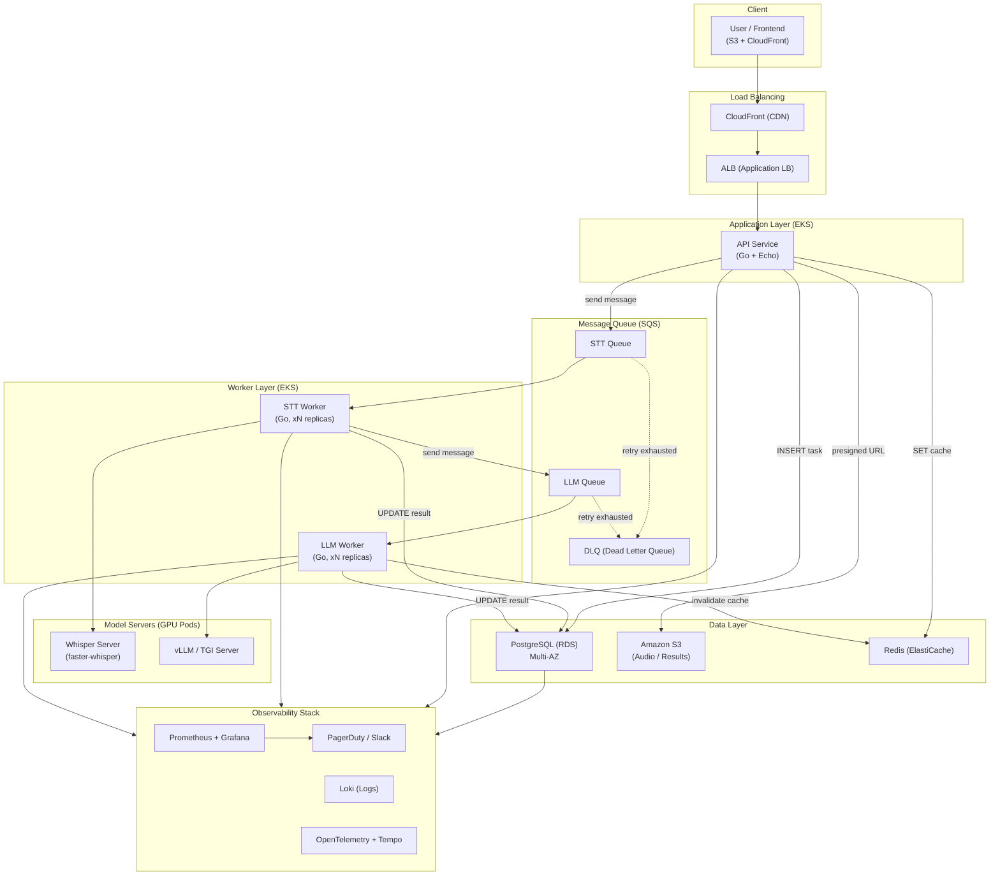
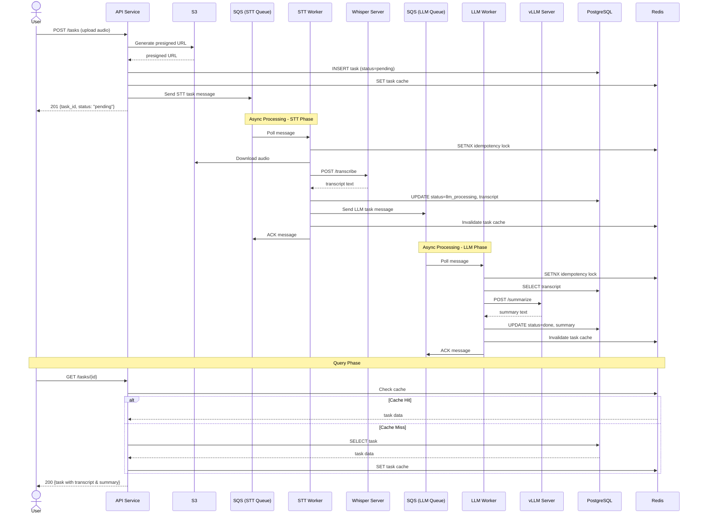
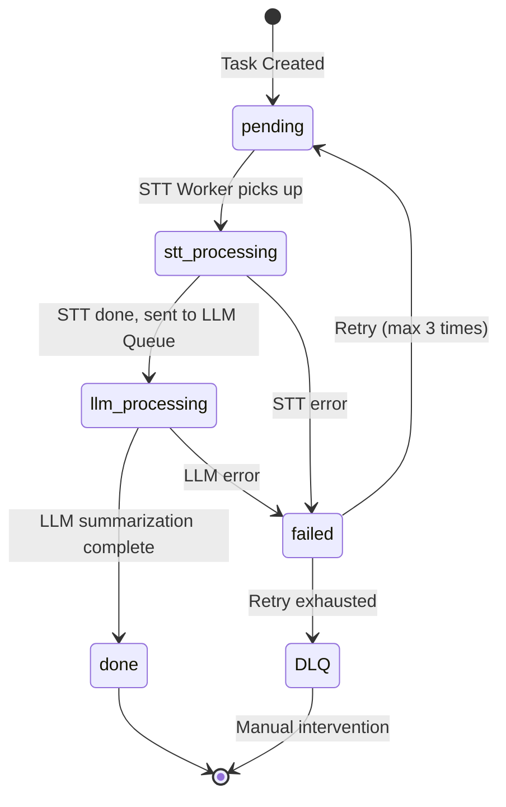
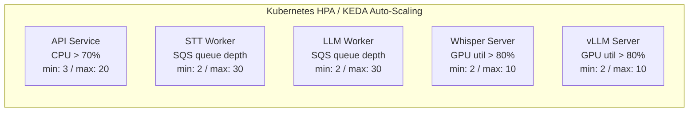
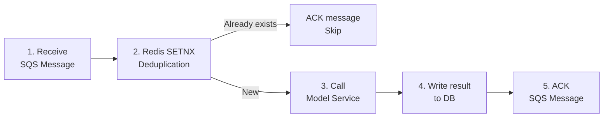
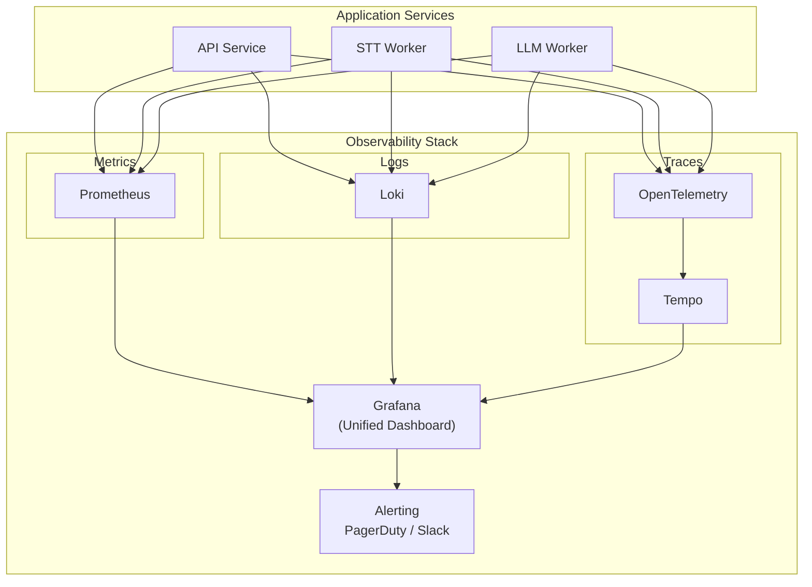
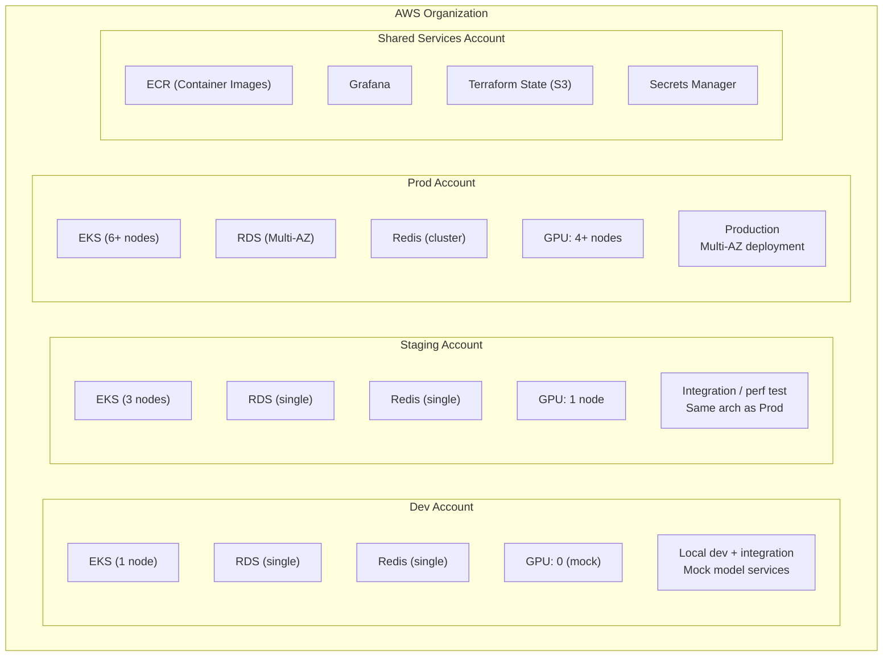
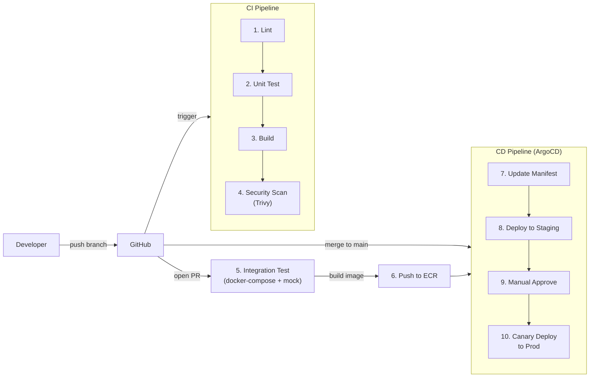

# AI Processing Platform — System Architecture Design

## 1. Overview

This platform is a scalable, production-ready AI task processing system that integrates two core AI capabilities: Speech-to-Text (STT) and LLM-based text summarization. After a user uploads an audio file, the system processes it through an event-driven microservice architecture, performing speech-to-text transcription followed by LLM summarization, and stores the results for subsequent retrieval. The architecture supports 2,000+ concurrent tasks, with all services developed in Go, backed by AWS cloud services (EKS, SQS, S3, RDS, ElastiCache) and Kubernetes orchestration to achieve horizontal auto-scaling, fault-tolerant retries, and end-to-end observability.

---

## 2. System Architecture



### Service Responsibilities

| Service | Language / Tech | Responsibilities |
|---------|----------------|-----------------|
| **API Service** | Go (Echo) | Accepts uploads, creates tasks, queries results, sends WebSocket notifications |
| **STT Worker** | Go | Consumes the STT Queue, calls Whisper Server API, writes results back and forwards to LLM Queue |
| **LLM Worker** | Go | Consumes the LLM Queue, calls vLLM/TGI API, writes final summary results |
| **Whisper Server** | faster-whisper (Container) | GPU Pod providing a REST API for speech-to-text transcription |
| **vLLM / TGI** | vLLM (Container) | GPU Pod providing a REST API for text summarization |
| **PostgreSQL (RDS)** | - | Task metadata, status, and result text |
| **S3** | - | Raw audio files and large result files |
| **Redis (ElastiCache)** | - | Task status cache, rate limiting, idempotency checks |
| **SQS** | - | STT Queue + LLM Queue + DLQ for task decoupling and retry support |

---

## 3. Task Flow



### Data Flow Summary

| Step | Action | Data Store |
|------|--------|-----------|
| 1 | User uploads audio | S3 (direct upload via presigned URL, bypassing API Server) |
| 2 | API Service creates the task record | PostgreSQL `tasks` table (status=pending) |
| 3 | Send STT task message | SQS STT Queue |
| 4 | STT Worker downloads audio and calls Whisper | S3 -> Whisper Server |
| 5 | Write transcript result back | PostgreSQL (transcript column) |
| 6 | Send LLM task message | SQS LLM Queue |
| 7 | LLM Worker reads transcript and calls vLLM | PostgreSQL -> vLLM Server |
| 8 | Write summary result back | PostgreSQL (summary column, status=done) |
| 9 | User queries result | Redis cache -> PostgreSQL fallback |

---

## 4. Task State Machine



### Key Design Decisions

- **S3 Presigned URL Direct Upload** -- Audio files can be large; direct upload avoids consuming API Server bandwidth and memory.
- **Two-stage Queue** -- STT and LLM use separate queues, allowing each to scale and retry independently.
- **DLQ (Dead Letter Queue)** -- Tasks that fail after 3 retries are routed to the DLQ, triggering alerts for manual intervention.
- **Idempotency** -- Workers record processed message IDs in Redis to prevent duplicate processing.

---

## 5. Technology Selection

### Language & Framework

| Technology | Choice | Rationale |
|-----------|--------|-----------|
| **API Service** | Go + Echo | Echo is lightweight and high-performance with a mature middleware ecosystem (auth, CORS, rate limit), well-suited for high-concurrency APIs. |
| **Workers** | Go | Goroutines are naturally suited for heavy I/O waiting (waiting for Whisper/vLLM responses), with low memory footprint. A single Pod can handle a large number of concurrent tasks. |
| **Frontend** | React + TypeScript | Mainstream framework, built with Vite. The frontend is not the focus of this design. |

### Cloud Services (AWS)

| Requirement | AWS Service | Rationale |
|-------------|------------|-----------|
| **Container Orchestration** | EKS (Kubernetes) | Supports GPU node groups, HPA auto-scaling, and deep integration with AWS. |
| **Message Queue** | SQS | Fully managed with native DLQ and visibility timeout support; no broker maintenance required. |
| **Object Storage** | S3 | Audio file storage with presigned URL direct upload and lifecycle policies for automatic cleanup. |
| **RDBMS** | RDS PostgreSQL (Multi-AZ) | ACID guarantees for task state consistency; Multi-AZ provides automatic failover. |
| **Cache** | ElastiCache Redis | Task status cache, rate limiting, and idempotency checks. |
| **CDN** | CloudFront | Accelerates frontend static asset delivery. |
| **Load Balancer** | ALB | Layer 7 routing with WebSocket support for task progress notifications. |
| **DNS** | Route 53 | Health checks and failover routing. |

### Database / Cache / Queue Comparison

**Why SQS over Kafka or RabbitMQ?**

| Aspect | SQS | Kafka | RabbitMQ |
|--------|-----|-------|----------|
| **Ops Cost** | Fully managed, zero ops | Requires cluster management or MSK (expensive) | Requires self-hosting or AmazonMQ |
| **Use Case Fit** | Task queue (each message processed once) | Event streaming / logs (requires replay) | Complex routing (not needed here) |
| **DLQ Support** | Built-in natively | Must be implemented manually | Native support |
| **Scalability** | Automatic, no upper limit | Requires pre-configured partition count | Requires manual scaling |

**Conclusion**: The use case is a "task queue," not an "event stream." Each message is processed exactly once, making SQS the best fit with zero operational overhead.

> **Note**: The local development environment uses RabbitMQ as a drop-in replacement for SQS, running via docker-compose with a consistent interface.

### Model Deployment Strategy

| Model | Deployment | Detail |
|-------|-----------|--------|
| **STT (Whisper)** | Container on EKS GPU node | faster-whisper-server on g5.xlarge, providing an OpenAI-compatible API |
| **LLM (Summary)** | Container on EKS GPU node | vLLM on g5.2xlarge, supporting continuous batching to maximize GPU utilization |

**Why self-hosted over AWS managed AI services (Transcribe / Bedrock)?**

| Aspect | Self-hosted Models | AWS Managed AI |
|--------|-------------------|----------------|
| **Cost** | GPU instances are more cost-effective at high concurrency | Per-API-call pricing; very expensive at 2,000+ concurrency |
| **Latency** | In-VPC calls with latency < 50ms | Public API calls with higher latency |
| **Control** | Full control over model versions, batch size, and quantization | Black box with no tuning options |
| **Offline** | No external service dependency | Fully dependent on AWS |

**Trade-off**: Self-hosting requires managing GPU nodes, but at 2,000+ concurrency the cost and performance advantages are significant. For smaller initial scale, start with managed services and migrate gradually.

### Database Schema (Core)

```sql
CREATE TABLE tasks (
    id          UUID PRIMARY KEY DEFAULT gen_random_uuid(),
    status      VARCHAR(20) NOT NULL DEFAULT 'pending',
    audio_key   VARCHAR(512) NOT NULL,
    transcript  TEXT,
    summary     TEXT,
    error_msg   TEXT,
    retry_count INT DEFAULT 0,
    created_at  TIMESTAMPTZ DEFAULT NOW(),
    updated_at  TIMESTAMPTZ DEFAULT NOW()
);

CREATE INDEX idx_tasks_status ON tasks(status);
CREATE INDEX idx_tasks_created_at ON tasks(created_at);
```

---

## 6. Architecture Characteristics

### 6.1 Scalability



- **KEDA** -- Automatically adjusts Worker replica count based on SQS queue depth.
- **Cluster Autoscaler** -- Automatically provisions new EC2 nodes when Pods cannot be scheduled.
- **GPU Nodes** -- EKS managed node group with Spot Instances to reduce cost (with On-Demand fallback).
- **RDS Read Replica** -- Add read replicas to offload read traffic when query volume is high.

**Plug-in Task Extension:**

```go
// Adding a new AI task only requires implementing the TaskProcessor interface
type TaskProcessor interface {
    ProcessTask(ctx context.Context, task *Task) (*TaskResult, error)
    QueueName() string
}

// Register a new processor without modifying core logic
registry.Register("stt", &STTProcessor{})
registry.Register("llm", &LLMProcessor{})
registry.Register("sentiment", &SentimentProcessor{})  // Future addition
```

### 6.2 Fault Tolerance

| Failure Scenario | Strategy |
|-----------------|----------|
| **Worker crash** | SQS visibility timeout expires and the message is automatically redelivered; another Worker takes over. |
| **Model service unresponsive** | Worker configured with timeout + exponential backoff retry (max 3 attempts). |
| **Retry exhausted** | Message moves to DLQ, triggering a CloudWatch Alarm -> PagerDuty alert. |
| **PostgreSQL primary down** | RDS Multi-AZ automatic failover (< 60 seconds). |
| **Redis down** | ElastiCache Multi-AZ with automatic failover; falls back to DB on cache miss. |
| **Entire AZ down** | EKS Pods distributed across multiple AZs; ALB automatically routes around unhealthy AZs. |
| **API Service down** | K8s liveness/readiness probes auto-restart; ALB health checks remove unhealthy instances. |

**Key Mechanisms:**

- **SQS Visibility Timeout** -- Set to 2x the maximum expected task processing time (e.g., if STT processing takes ~2 minutes, set timeout to 4 minutes).
- **Idempotent Processing** -- Workers use Redis `SETNX` to lock the task_id, ensuring the same task is not processed twice.
- **Circuit Breaker** -- Worker calls to model services include a circuit breaker; requests are paused when the error rate exceeds 50% to prevent cascading failures.

### 6.3 Data Consistency



- **Write-then-ACK** -- The result is written to the database before the message is acknowledged, ensuring the result is persisted before confirming the message.
- **Idempotency** -- If a Worker crashes after writing to the DB but before sending the ACK, the message is redelivered. The idempotency mechanism ensures no duplicate writes occur.
- **DB Transaction** -- Status updates and result writes are performed within a single database transaction.

### 6.4 Latency & Performance

| Strategy | Description |
|----------|------------|
| **Async Processing + WebSocket** | Returns task_id immediately after upload; pushes progress updates in real time via WebSocket. |
| **S3 Presigned URL Direct Upload** | Audio files are uploaded directly to S3, bypassing the API Server. |
| **vLLM Continuous Batching** | Multiple LLM requests are dynamically batched, improving throughput by 3-5x. |
| **Redis Result Cache** | Query results served from cache in < 5ms on cache hit. |
| **Connection Pooling** | Go Workers maintain connection pools to the DB, Redis, and model services. |

**Expected Latency:**

| Phase | Latency |
|-------|---------|
| Upload -> receive task_id | < 200ms |
| STT processing (1 min audio) | ~10-30s |
| LLM summarization | ~5-15s |
| Query result (cache hit) | < 50ms |

### 6.5 Security

| Layer | Measure |
|-------|---------|
| **API Auth** | JWT tokens (short-lived) + API Keys (service-to-service); unified validation via middleware. |
| **S3 Access** | Presigned URLs with 15-minute expiry; bucket policy denies public access. |
| **Transport Encryption** | End-to-end HTTPS/TLS; TLS terminated at ALB. |
| **At-rest Encryption** | S3 SSE-S3 encryption; RDS storage encryption. |
| **Network Isolation** | Model services and databases reside in private subnets; only Workers can access them. |
| **Rate Limiting** | Redis-based sliding window; API-layer throttling (100 req/min per user). |
| **File Validation** | Upload file MIME type and size limit (500MB) validation. |
| **Secrets Management** | AWS Secrets Manager for DB passwords and API keys. |

### 6.6 Observability



| Aspect | Tool | Key Metrics |
|--------|------|-------------|
| **Metrics** | Prometheus + Grafana | Task processing rate, queue depth, API P95/P99 latency, GPU utilization, error rate |
| **Logs** | Loki (structured JSON log) | Complete processing chain for each task, error details |
| **Traces** | OpenTelemetry + Tempo | End-to-end tracing per task (API -> Queue -> Worker -> Model) with trace_id |
| **Alerting** | Grafana Alerting | DLQ has messages, error rate > 5%, P99 latency > threshold, GPU nodes unavailable |

**Task-level Tracing**: Each task is bound to a `trace_id`, enabling one-click full-chain tracing in Grafana by task_id.

---

## 7. Deployment

### Deployment Topology



### CI/CD Flow



| Phase | Trigger | Actions |
|-------|---------|---------|
| **CI** | push any branch | lint -> unit test -> build -> security scan (Trivy) |
| **PR Check** | open/update PR | Integration test (docker-compose + mock model) |
| **CD to Staging** | merge to `main` | Auto build image -> push to ECR -> ArgoCD sync to Staging |
| **CD to Prod** | Staging verified | Manual approve -> ArgoCD Canary deploy to Prod |

### Canary Deployment Strategy

```mermaid
gantt
    title Canary Deployment Phases
    dateFormat X
    axisFormat %s

    section Traffic Split
    Phase 1 - 10% new / 90% old  :a1, 0, 5
    Phase 2 - 30% new / 70% old  :a2, 5, 10
    Phase 3 - 100% new           :a3, 10, 15

    section Monitoring
    Monitor error rate < 1%       :crit, 0, 10
    Auto-rollback if threshold exceeded :crit, 0, 10
```



- Uses **Argo Rollouts** for automated canary deployments.
- Each phase automatically checks Prometheus metrics; automatic rollback is triggered if thresholds are not met.

### Rollback Strategy

| Scenario | Action |
|----------|--------|
| **Canary phase issue** | Argo Rollouts automatically rolls back with zero manual intervention. |
| **Post-release issue** | `kubectl argo rollouts undo` or revert via ArgoCD UI. |
| **DB migration rollback** | Every migration includes a corresponding down migration. |
| **Emergency rollback** | ArgoCD syncs to a specific Git commit hash. |

**Key Principles:**

- **GitOps** -- ArgoCD uses the Git repository as the single source of truth.
- **Immutable Tags** -- Container images are tagged with Git SHA.
- **Migration Separation** -- DB migrations are decoupled from application deployments; migrations must be backward-compatible.

---

## 8. Architecture Decision Records

| Decision | Choice | Alternative | Rationale |
|----------|--------|-------------|-----------|
| Full Go stack | Go API + Go Workers | Go + Python mixed | Model services are deployed independently; Workers only make HTTP calls, maximizing Go's concurrency advantage. |
| SQS as message queue | Amazon SQS | Kafka / RabbitMQ | Task queue use case; SQS is fully managed with zero ops and built-in DLQ. |
| Self-hosted models | faster-whisper + vLLM | AWS Transcribe + Bedrock | Clear cost and latency advantages at 2,000+ concurrency. |
| EKS orchestration | Amazon EKS | ECS / self-managed K8s | GPU node group support, HPA/KEDA ecosystem, industry standard. |
| Canary deployment | Argo Rollouts | Blue-Green / Rolling | Progressive validation with lowest rollback risk through automatic rollback. |
| GitOps | ArgoCD | Jenkins CD / Flux | Declarative deployment, Git as single source of truth, easy rollbacks. |

---

## 9. Project Structure

```
ai-processing-platform/
├── cmd/
│   ├── api/                    # API Service entry point
│   │   ├── main.go
│   │   └── Dockerfile
│   ├── stt-worker/             # STT Worker entry point
│   │   ├── main.go
│   │   └── Dockerfile
│   ├── llm-worker/             # LLM Worker entry point
│   │   ├── main.go
│   │   └── Dockerfile
│   ├── mock-stt/               # Mock Whisper server (dev)
│   │   ├── main.go
│   │   └── Dockerfile
│   └── mock-llm/               # Mock vLLM server (dev)
│       ├── main.go
│       └── Dockerfile
├── internal/
│   ├── config/                 # Environment config loading
│   │   └── config.go
│   ├── handler/                # HTTP handlers (Echo)
│   │   └── task_handler.go
│   ├── model/                  # Domain models
│   │   └── task.go
│   ├── queue/                  # Message queue abstraction
│   │   └── rabbitmq.go
│   └── repository/             # Database access layer
│       └── task_repo.go
├── migrations/
│   ├── 001_create_tasks.up.sql
│   └── 001_create_tasks.down.sql
├── docs/
│   └── plans/                  # Design & implementation docs
├── docker-compose.yml          # Local development stack
├── Makefile
├── go.mod
├── go.sum
├── ARCHITECTURE.md             # Architecture design (this file)
└── README.md                   # Quick start guide
```

---

## 10. Quick Start

### Prerequisites

- Docker & Docker Compose

### Start All Services

```bash
# Build and start all services (API, workers, mock models, infra)
docker compose up --build -d

# Verify all services are running
docker compose ps
```

### Create a Task

```bash
curl -s -X POST http://localhost:18080/api/v1/tasks \
  -H "Content-Type: application/json" \
  -d '{"audio_key": "uploads/test-audio-001.wav"}' | jq .
```

### Query Task Result

```bash
# Replace <task_id> with the UUID from the create response
curl -s http://localhost:18080/api/v1/tasks/<task_id> | jq .
```

### List All Tasks

```bash
curl -s http://localhost:18080/api/v1/tasks | jq .
```

### Stop Services

```bash
docker compose down
```

### Useful Links (Local Dev)

| Service | URL |
|---------|-----|
| API Service | http://localhost:18080 |
| RabbitMQ Management | http://localhost:35672 (user: `app`, pass: `devpassword`) |
| Mock STT Server | http://localhost:18081 |
| Mock LLM Server | http://localhost:18082 |
