# AI Processing Platform — System Architecture Design

## 1. Overview

This platform is an event-driven AI task processing system that accepts user-uploaded audio files, performs Speech-to-Text (STT) transcription followed by LLM-based summarization, and stores the results for on-demand retrieval. The complete task flow is: **User uploads audio → STT transcription → LLM summarization → store results → query**.

The architecture is designed as a **3-phase evolution** — MVP, Growth, and Scale — so that infrastructure complexity and cost grow in proportion to actual business demand. Each phase is a fully deployable system with clearly defined upgrade triggers. This approach avoids the common mistake of over-engineering at launch while still providing a credible path to high-scale production.

**Important distinction for async architectures:** In this system, QPS (queries per second) and task processing throughput are fundamentally different metrics, decoupled by the message queue:

| Metric | Definition | Bound By |
|--------|-----------|----------|
| **API Ingestion Rate** | Requests/sec the API can accept and enqueue | CPU, network, DB write IOPS |
| **Task Processing Throughput** | Tasks/min completed end-to-end | GPU inference speed (STT is the bottleneck) |
| **Query QPS** | Result lookups/sec | Redis cache hit rate, DB read IOPS |

The queue acts as a buffer: the API can accept bursts far exceeding the GPU processing rate without dropping requests. Tasks simply wait longer in the queue during spikes.

---

## 2. Capacity Planning & Phased Architecture

### 2.1 Bottom-Up Capacity Model

All throughput estimates are derived from measured GPU inference speeds, not arbitrary targets:

| Model | Hardware | Inference Time (1-min audio) | Throughput per GPU |
|-------|----------|-----------------------------|--------------------|
| **faster-whisper large-v3** (STT) | NVIDIA A10G (g5.xlarge) | ~5-6 seconds | **10-12 tasks/min** |
| **vLLM 7B** with continuous batching (LLM) | NVIDIA A10G (g5.xlarge) | ~1.2-2 seconds per task | **30-50 tasks/min** |

**Key insight:** STT is the pipeline bottleneck — it is roughly 3-5x slower than LLM inference. Capacity planning must be STT-centric. To achieve N tasks/min of end-to-end throughput, you need approximately N/10 STT GPUs but only N/40 LLM GPUs.

---

### 2.2 Phase 1: MVP

**Target:** ~10-20 tasks/min sustained throughput | < 50K tasks/month | POC validation

The MVP prioritizes speed-to-market and operational simplicity. No GPUs, no Kubernetes — we use fully managed AWS AI services and serverless compute to minimize the ops surface area.

#### Architecture Diagram

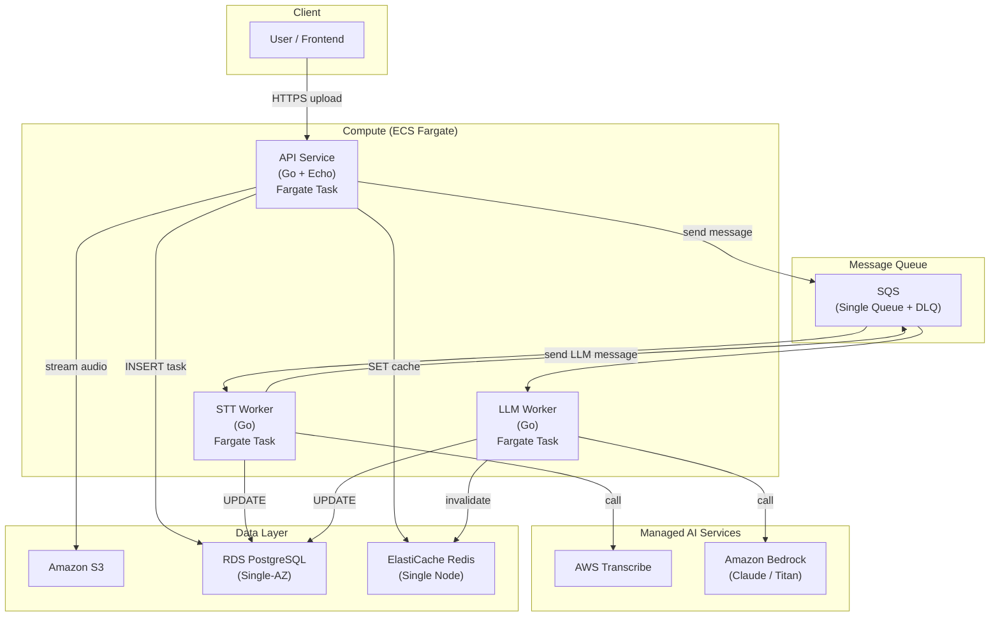

#### Design Rationale

- **ECS Fargate over EKS:** No cluster to manage, no EC2 instances to patch. Fargate bills per-second for actual usage. At this scale, EKS control plane ($73/month) + node management overhead is not justified.
- **AWS Transcribe over self-hosted Whisper:** No GPU nodes needed. Pay-per-minute pricing is acceptable below 50K tasks/month. Zero model management.
- **Amazon Bedrock over self-hosted LLM:** Same rationale — no GPU. Access to frontier models (Claude, Titan) without infrastructure.
- **Single SQS Queue:** At low volume, a single queue with message attributes to distinguish STT vs. LLM tasks is simpler than two queues. Workers filter by attribute.
- **Single-AZ RDS:** Multi-AZ doubles RDS cost. For a POC, planned downtime during failover is acceptable.
- **Single-node Redis:** No replication needed at this scale.

#### Cost Breakdown

| Resource | Spec | Monthly Cost (est.) |
|----------|------|-------------------|
| ECS Fargate (API) | 0.5 vCPU, 1 GB, always-on | ~$15 |
| ECS Fargate (STT Worker) | 0.5 vCPU, 1 GB, always-on | ~$15 |
| ECS Fargate (LLM Worker) | 0.5 vCPU, 1 GB, always-on | ~$15 |
| AWS Transcribe | 50K min audio @ $0.024/min | ~$1,200 |
| Amazon Bedrock (Claude Haiku) | 50K calls @ ~$0.003/call | ~$150 |
| RDS PostgreSQL | db.t4g.micro, Single-AZ, 20 GB | ~$15 |
| ElastiCache Redis | cache.t4g.micro, single node | ~$12 |
| S3 | 100 GB storage + requests | ~$5 |
| SQS | 50K messages | ~$0.02 |
| **Total** | | **~$800-1,500** |

> Note: AWS Transcribe is the dominant cost, accounting for ~80% of the total. This is the key driver for the Phase 2 migration.

#### Limitations

- **Linear cost scaling:** Every additional task costs the same amount (no economies of scale with managed AI services).
- **No Multi-AZ:** Single points of failure in RDS and Redis.
- **No canary deployment:** ECS rolling update only.
- **Higher latency:** AWS Transcribe and Bedrock calls cross the public internet (within AWS region, but still higher than in-VPC).
- **Vendor lock-in:** Tightly coupled to AWS Transcribe API format.

#### Upgrade Trigger → Phase 2

| Condition | Threshold |
|-----------|-----------|
| Monthly managed AI cost | Exceeds **$3,000/month** |
| Task volume | Approaching **50K tasks/month** |
| Latency SLA | P95 end-to-end > 60 seconds and can't be improved |
| Feature needs | Require custom model fine-tuning or offline processing |

---

### 2.3 Phase 2: Growth

**Target:** ~20-50 tasks/min sustained throughput | burst to ~100-200 tasks/min | 50K-500K tasks/month | Proven product-market fit

Phase 2 introduces self-hosted GPU models and Kubernetes orchestration. The marginal cost per task drops significantly, and we gain full control over model versions and inference parameters.

#### Architecture Diagram

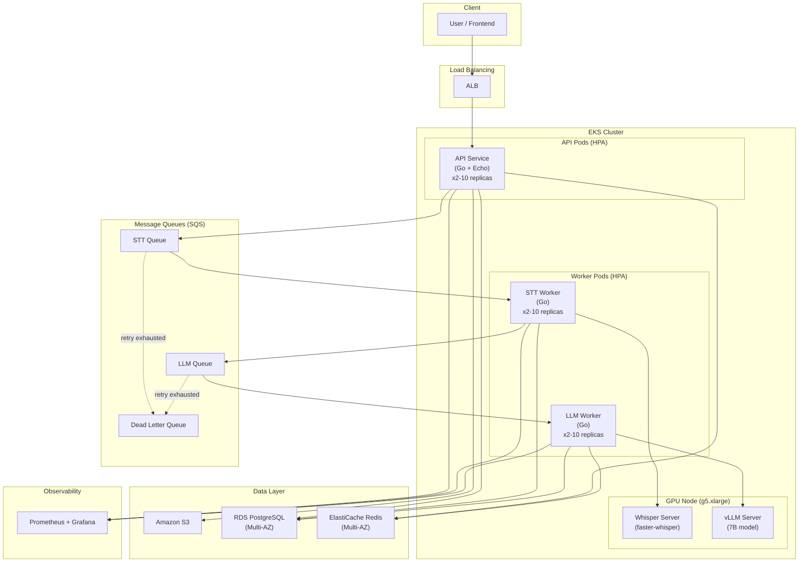

#### Key Changes from MVP

| Dimension | MVP (Phase 1) | Growth (Phase 2) | Why |
|-----------|--------------|-------------------|-----|
| **Compute** | ECS Fargate | EKS | GPU node groups, HPA, richer scaling |
| **STT** | AWS Transcribe ($0.024/min) | Self-hosted faster-whisper (1 GPU) | Cost drops from ~$1,200/month to ~$420/month (GPU cost) at 50K tasks |
| **LLM** | Amazon Bedrock | Self-hosted vLLM 7B (1 GPU) | Cost drops from ~$150/month to GPU amortized; plus lower latency |
| **Queue** | Single SQS queue | Two-stage SQS (STT + LLM) | Independent scaling, independent retry, independent DLQ per stage |
| **RDS** | Single-AZ | Multi-AZ | Automatic failover for production reliability |
| **Redis** | Single node | Multi-AZ | Automatic failover |
| **Observability** | CloudWatch + Langfuse | Prometheus + Grafana + Langfuse | Add LLM-native tracing from day 1, then richer infra visibility |

#### Throughput Estimate

With 1 STT GPU and 1 LLM GPU:

| Component | Capacity |
|-----------|----------|
| STT (1x A10G) | ~10-12 tasks/min steady state |
| LLM (1x A10G) | ~30-50 tasks/min steady state |
| **Pipeline bottleneck** | **~10-12 tasks/min** (STT-bound) |
| **With 2x STT GPU scale-up** | **~20-24 tasks/min** |

For burst handling up to 200 tasks/min, the SQS queue absorbs the burst. The queue depth grows, and tasks are processed as fast as the GPU allows. HPA scales the Go worker pods (which are CPU-cheap) to keep the GPU pipeline fed. The GPU itself is the hard ceiling.

> To sustain 200 tasks/min *continuously*, you would need ~17-20 STT GPUs and ~4-5 LLM GPUs. At Phase 2, we anticipate burst-to-200 but sustained throughput around 10-50 tasks/min with 1-4 GPU nodes.

#### Cost Breakdown

| Resource | Spec | Monthly Cost (est.) |
|----------|------|-------------------|
| EKS Control Plane | 1 cluster | ~$73 |
| EC2 (EKS nodes) | 3x m5.large (API + workers) | ~$210 |
| EC2 GPU (STT) | 1x g5.xlarge (A10G) | ~$420 |
| EC2 GPU (LLM) | 1x g5.xlarge (A10G) | ~$420 |
| RDS PostgreSQL | db.t4g.medium, Multi-AZ, 50 GB | ~$70 |
| ElastiCache Redis | cache.t4g.small, Multi-AZ | ~$50 |
| ALB | 1 ALB + LCU | ~$25 |
| S3 | 500 GB storage + requests | ~$15 |
| SQS | 500K messages | ~$0.20 |
| Prometheus + Grafana (EKS add-on) | Self-hosted on EKS | ~$0 (runs on existing nodes) |
| **Total** | | **~$3,000-6,000** |

> Cost scales with GPU count. Adding a second STT GPU adds ~$420/month but doubles STT throughput.

#### Limitations

- **Single GPU per model is a hard ceiling:** If the STT GPU is saturated, the only option is to add another GPU node (manual or cluster autoscaler, but no KEDA-driven GPU scaling yet).
- **No KEDA:** HPA scales workers based on CPU, not SQS queue depth. This means scaling is reactive rather than proactive.
- **No canary deployment:** Rolling updates in EKS only.
- **Observability baseline:** Prometheus + Grafana + Langfuse cover metrics, dashboards, and LLM traces, but centralized logging and full distributed tracing are still limited.

#### Upgrade Trigger → Phase 3

| Condition | Threshold |
|-----------|-----------|
| GPU utilization | Consistently **> 80%** across all GPU nodes |
| Queue depth | SQS ApproximateNumberOfMessages growing over time (tasks queuing faster than processed) |
| Deployment needs | Require zero-downtime deployment with progressive rollout |
| Observability gaps | Debugging cross-service issues requires distributed tracing |
| Task volume | Approaching **500K tasks/month** |

---

### 2.4 Phase 3: Scale

**Target:** ~200-1,000+ tasks/min sustained throughput | 500K+ tasks/month | High-traffic production

Phase 3 is the fully mature architecture with event-driven auto-scaling, multi-GPU pools, canary deployments, and comprehensive observability. Every component is designed for high availability and operational excellence.

#### Architecture Diagram

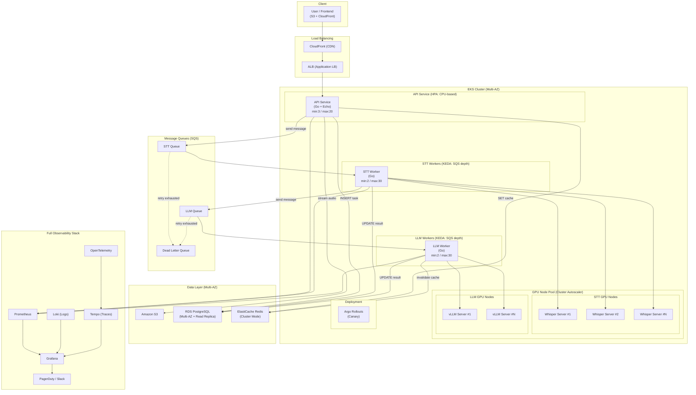

#### Key Changes from Growth

| Dimension | Growth (Phase 2) | Scale (Phase 3) | Why |
|-----------|-----------------|------------------|-----|
| **Scaling** | HPA (CPU-based) | KEDA (SQS queue depth) + Cluster Autoscaler | Proactive scaling: workers scale before CPU spikes, based on actual queue backlog |
| **GPU** | 1 GPU per model (fixed) | Multi-GPU pool (Spot + On-Demand mix) | Horizontal GPU scaling with cost optimization via Spot instances (up to 60% savings) |
| **CDN** | None | CloudFront | Frontend static assets acceleration |
| **DB** | Multi-AZ only | Multi-AZ + Read Replica | Offload query traffic from primary; support high Query QPS |
| **Cache** | Multi-AZ | Cluster Mode | Sharded across nodes for higher throughput and larger dataset |
| **Deployment** | Rolling update | Argo Rollouts canary | Progressive traffic shifting (10% → 30% → 100%) with automatic rollback on metric degradation |
| **Observability** | Prometheus + Grafana | Full stack: Prometheus, Grafana, Loki, OpenTelemetry, Tempo, PagerDuty | Metrics + Logs + Traces + Alerting — all correlated by trace_id |
| **Extensibility** | Hardcoded STT + LLM | Plug-in TaskProcessor interface | New AI task types (sentiment, NER, translation) can be added without modifying core logic |

#### Throughput Estimate

| Configuration | STT Throughput | LLM Throughput | Pipeline Throughput |
|--------------|---------------|----------------|-------------------|
| 4 STT GPUs + 2 LLM GPUs | ~40-48 tasks/min | ~60-100 tasks/min | ~40-48 tasks/min |
| 10 STT GPUs + 3 LLM GPUs | ~100-120 tasks/min | ~90-150 tasks/min | ~100-120 tasks/min |
| 20 STT GPUs + 5 LLM GPUs | ~200-240 tasks/min | ~150-250 tasks/min | ~200-240 tasks/min |
| **100 STT GPUs + 25 LLM GPUs** | **~1,000-1,200 tasks/min** | **~750-1,250 tasks/min** | **~1,000+ tasks/min** |

> The GPU count scales linearly. 1,000 tasks/min requires ~100 STT GPU nodes — this is a significant infrastructure footprint. In practice, most systems would also consider model optimization (quantization, distillation) and audio pre-filtering to reduce the GPU requirement.

#### Cost Breakdown

| Resource | Spec | Monthly Cost (est.) |
|----------|------|-------------------|
| EKS Control Plane | 1 cluster | ~$73 |
| EC2 (EKS CPU nodes) | 6x m5.large (API + workers) | ~$420 |
| EC2 GPU - STT (On-Demand) | 2x g5.xlarge | ~$840 |
| EC2 GPU - STT (Spot) | 2x g5.xlarge @ ~40% discount | ~$500 |
| EC2 GPU - LLM (On-Demand) | 1x g5.xlarge | ~$420 |
| EC2 GPU - LLM (Spot) | 1x g5.xlarge @ ~40% discount | ~$250 |
| RDS PostgreSQL | db.r6g.large, Multi-AZ + 1 Read Replica, 200 GB | ~$450 |
| ElastiCache Redis | cache.r6g.large, Cluster Mode, 3 shards | ~$550 |
| ALB | 1 ALB + LCU (higher traffic) | ~$50 |
| CloudFront | 1 TB transfer/month | ~$85 |
| S3 | 2 TB storage + requests | ~$50 |
| SQS | 5M messages | ~$2 |
| Observability (Loki, Tempo storage) | S3-backed, ~500 GB | ~$15 |
| PagerDuty | 1 team | ~$50 |
| **Total (baseline 6 GPUs)** | | **~$3,800** |
| **Total (scaled to 20+ GPUs)** | | **~$10,000-25,000** |

> GPU cost dominates at scale. Spot instances and Reserved Instances (1-year commit for 30-40% savings) are essential cost levers.

#### Plug-in Task Extension Interface

At Phase 3, the system supports adding new AI task types without modifying the core pipeline:

```go
// TaskProcessor is the plug-in interface for adding new AI task types.
// Adding a new AI capability (e.g., sentiment analysis, NER, translation)
// only requires implementing this interface and registering it.
type TaskProcessor interface {
    // ProcessTask executes the AI inference for a single task.
    ProcessTask(ctx context.Context, task *Task) (*TaskResult, error)
    // QueueName returns the SQS queue this processor consumes from.
    QueueName() string
    // TaskType returns the identifier used in message routing.
    TaskType() string
}

// Registration — no changes to core pipeline code needed.
func main() {
    registry := NewProcessorRegistry()
    registry.Register("stt", &STTProcessor{})
    registry.Register("llm", &LLMProcessor{})
    registry.Register("sentiment", &SentimentProcessor{})  // New task type
    registry.Register("ner", &NERProcessor{})              // Another new type

    // The generic worker engine consumes from each queue
    // and dispatches to the registered processor.
    engine := NewWorkerEngine(registry, sqsClient, db)
    engine.Run(ctx)
}
```

---

### 2.5 Phase Comparison Summary

| Dimension | Phase 1: MVP | Phase 2: Growth | Phase 3: Scale |
|-----------|-------------|-----------------|----------------|
| **Monthly Cost** | $800-1,500 | $3,000-6,000 | $10,000-25,000 |
| **Cost per Task** | ~$0.027 (Transcribe-dominated) | ~$0.008-0.012 | ~$0.004-0.008 |
| **Processing Throughput** | ~10-20 tasks/min sustained | ~20-50 tasks/min sustained | ~200-1,000+ tasks/min sustained |
| **Burst Handling** | Limited by managed API rate limits | SQS absorbs bursts; GPU processes steadily | KEDA + Cluster Autoscaler provisions GPU on demand |
| **Compute** | ECS Fargate (serverless) | EKS (managed K8s) | EKS + KEDA + Cluster Autoscaler |
| **AI Models** | AWS Transcribe + Bedrock | Self-hosted Whisper + vLLM (1 GPU each) | Multi-GPU pool (Spot + On-Demand) |
| **Database** | RDS Single-AZ | RDS Multi-AZ | RDS Multi-AZ + Read Replica |
| **Cache** | ElastiCache single node | ElastiCache Multi-AZ | ElastiCache Cluster Mode |
| **Queue** | SQS single queue | SQS two-stage (STT + LLM) | SQS two-stage + KEDA-driven scaling |
| **Deployment** | ECS rolling update | EKS rolling update | Argo Rollouts canary (10→30→100%) |
| **Observability** | CloudWatch + Langfuse | Prometheus + Grafana + Langfuse | Prometheus + Grafana + Loki + OTel + Tempo + Langfuse + PagerDuty |
| **Fault Tolerance** | S3 + SQS durable; single-AZ DB risk | Multi-AZ DB/cache; SQS retry + DLQ | Full Multi-AZ; circuit breaker; automatic failover everywhere |
| **Ops Complexity** | Minimal (all managed) | Moderate (K8s + GPU management) | High (multi-GPU, KEDA, canary, full observability) |
| **Time to Deploy** | 1-2 days | 1-2 weeks | 2-4 weeks |

---

### 2.6 Cost Crossover Analysis

The critical question: **When does self-hosting GPU models become cheaper than managed services?**

#### Per-Task Cost Comparison

| Volume (tasks/month) | AWS Transcribe + Bedrock | Self-Hosted (1 STT GPU + 1 LLM GPU) | Savings |
|---------------------|-------------------------|-------------------------------------|---------|
| 10,000 | ~$270 | ~$840 (GPU idle most of time) | Managed is **68% cheaper** |
| 30,000 | ~$810 | ~$840 | **Break-even** |
| 50,000 | ~$1,350 | ~$840 | Self-hosted is **38% cheaper** |
| 100,000 | ~$2,700 | ~$840 (1 GPU still sufficient) | Self-hosted is **69% cheaper** |
| 200,000 | ~$5,400 | ~$1,260 (2 STT GPUs needed) | Self-hosted is **77% cheaper** |
| 500,000 | ~$13,500 | ~$2,520 (4 STT GPUs + 1 LLM GPU) | Self-hosted is **81% cheaper** |

**Assumptions:**
- AWS Transcribe: $0.024/min, average audio length 1 minute
- Bedrock (Claude Haiku): ~$0.003/task (input + output tokens)
- g5.xlarge On-Demand: ~$0.42/hr → ~$302/month (730 hrs, but accounting for EKS overhead → ~$420/month amortized)
- 1 STT GPU handles ~10 tasks/min → ~432K tasks/month at 100% utilization (~300K at 70% target utilization)

#### Key Takeaway

The crossover point is approximately **30K-50K tasks/month**. Below this, managed services win on total cost because you are paying for idle GPU time. Above this, self-hosted wins and the gap widens rapidly because GPU cost is fixed while managed service cost is linear.

This crossover directly maps to our Phase 1 → Phase 2 upgrade trigger: **when monthly managed AI cost exceeds $3,000** (roughly 110K Transcribe minutes, or ~50K-100K tasks depending on audio length).

---

## 3. Task Flow

The task processing flow is consistent across all three phases — only the underlying infrastructure changes. The sequence diagram below shows the full async processing pipeline.

### Sequence Diagram

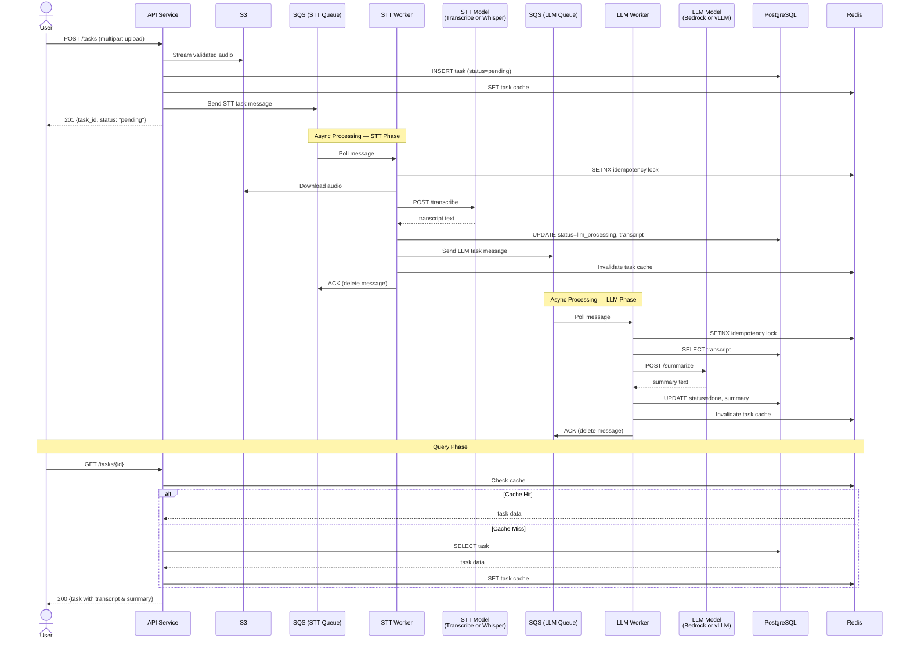

### Data Flow Summary

| Step | Action | Data Store | Notes |
|------|--------|-----------|-------|
| 1 | User uploads audio to API | API Service | Multipart upload with auth and validation |
| 2 | API streams validated audio to object storage | S3 | Stores object and records `s3_key` for downstream workers |
| 3 | API creates task record | PostgreSQL `tasks` table (status=pending) | Returns task_id immediately |
| 4 | Send STT task message | SQS STT Queue | Decouples ingestion from processing |
| 5 | STT Worker downloads audio, calls model | S3 → STT Model | GPU-bound step (~5-6s per 1-min audio) |
| 6 | Write transcript result | PostgreSQL (transcript column, status=llm_processing) | Write-then-ACK pattern |
| 7 | Send LLM task message | SQS LLM Queue | Second stage of pipeline |
| 8 | LLM Worker reads transcript, calls model | PostgreSQL → LLM Model | GPU-bound step (~1-2s per task) |
| 9 | Write summary result | PostgreSQL (summary column, status=done) | Final state |
| 10 | User queries result | Redis cache → PostgreSQL fallback | < 5ms on cache hit |

### Task State Machine

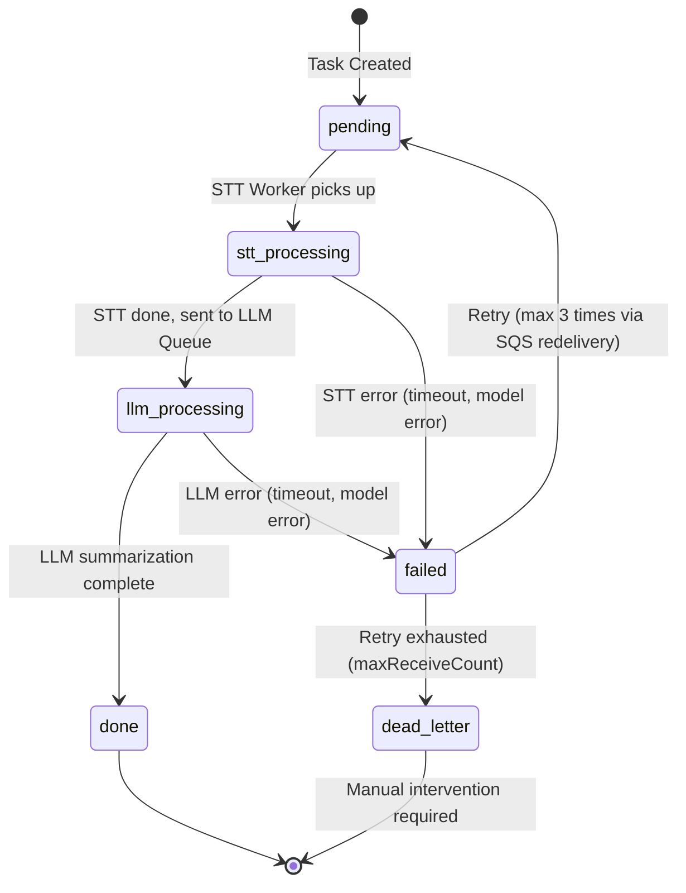

**State transitions are strictly enforced in the database via status column constraints.** Each worker validates the expected current state before transitioning, preventing race conditions in concurrent processing.

---

## 4. Technology Selection & Rationale

### 4.1 Language & Framework

| Technology | Choice | Rationale | Alternatives Considered |
|-----------|--------|-----------|------------------------|
| **API Service** | Go + Echo | Echo is lightweight with mature middleware (auth, CORS, rate limiting). Go's goroutines handle high concurrency with minimal memory (~2KB per goroutine vs. ~1MB per OS thread). Well-suited for I/O-bound API servers. | Gin (similar perf, less middleware), Fiber (fasthttp-based, less standard), Node.js (higher memory, callback complexity) |
| **Workers** | Go | Workers spend most time waiting for HTTP responses from model servers — goroutines excel at this I/O wait pattern. Single binary deployment simplifies container images. | Python (natural for ML but poor concurrency), Java (higher memory footprint), Rust (overkill for HTTP-call orchestration) |
| **Frontend** | React + TypeScript | Industry standard, large ecosystem, built with Vite. The frontend is not the focus of this architecture. | — |

**Why Go over Python for Workers?** The workers do not run ML models directly — they are HTTP clients that call model server APIs. Go's advantages (low memory, fast startup, simple deployment, excellent concurrency) outweigh Python's ML ecosystem advantage, which is irrelevant for HTTP call orchestration.

### 4.2 Cloud Services (AWS)

| Requirement | AWS Service | Rationale | Alternatives Considered |
|-------------|------------|-----------|------------------------|
| **Container Orchestration** | EKS (Phase 2+) / ECS Fargate (Phase 1) | EKS: GPU node groups, HPA/KEDA, rich ecosystem. Fargate: zero ops for MVP. | Self-managed K8s (high ops burden), Docker Compose (no auto-scaling) |
| **Message Queue** | SQS | Fully managed, native DLQ, visibility timeout, no broker to manage. Scales automatically. | See comparison below |
| **Object Storage** | S3 | API-mediated streaming upload, lifecycle policies, 11 nines durability. | EFS (overkill for blob storage), local disk (not durable) |
| **RDBMS** | RDS PostgreSQL | ACID for task state consistency. Multi-AZ automatic failover. Mature ecosystem. | Aurora (higher cost for this scale), DynamoDB (no relational queries on tasks) |
| **Cache** | ElastiCache Redis | Sub-ms latency for task cache, rate limiting, idempotency locks. | Memcached (no persistence, no pub/sub), DynamoDB DAX (DDB-only) |
| **CDN** | CloudFront (Phase 3) | Static frontend acceleration. | Cloudflare (cross-cloud complexity) |
| **Load Balancer** | ALB | Layer 7 routing, WebSocket support for task progress. | NLB (Layer 4 only, no WebSocket routing) |

### 4.3 Why SQS over Kafka or RabbitMQ?

| Aspect | SQS | Kafka | RabbitMQ |
|--------|-----|-------|----------|
| **Ops Cost** | Fully managed, zero ops | Requires cluster management or MSK (~$200+/month) | Requires self-hosting or AmazonMQ |
| **Use Case Fit** | Task queue (each message processed once) | Event streaming / log aggregation (requires replay) | Complex routing patterns |
| **DLQ Support** | Built-in natively | Must be implemented manually | Native support |
| **Scalability** | Automatic, virtually unlimited | Requires pre-configured partition count | Requires manual scaling |
| **KEDA Integration** | Native KEDA SQS scaler | KEDA Kafka scaler available | KEDA RabbitMQ scaler available |
| **Cost at 500K msgs/month** | ~$0.20 | ~$200+ (MSK minimum) | ~$50+ (AmazonMQ minimum) |

**Decision:** Our use case is a task queue, not an event stream. Each message is processed exactly once and then deleted. We do not need replay, ordering guarantees, or complex routing. SQS provides exactly the semantics we need at near-zero cost and zero operational burden.

> **Note:** The local development environment uses RabbitMQ as a drop-in replacement for SQS, running via docker-compose. The worker code abstracts the queue interface so the switch is transparent.

### 4.4 Why Self-Hosted Models over Managed Services (at Scale)?

| Aspect | Self-Hosted (faster-whisper + vLLM) | Managed (AWS Transcribe + Bedrock) |
|--------|-------------------------------------|-----------------------------------|
| **Cost at 50K tasks/month** | ~$840 (fixed GPU cost) | ~$1,350 (per-call pricing) |
| **Cost at 500K tasks/month** | ~$2,520 (4 GPUs) | ~$13,500 |
| **Latency** | In-VPC, < 50ms network overhead | Cross-service, higher tail latency |
| **Model Control** | Full: version pinning, quantization, batch size tuning | Black box — no tuning knobs |
| **Offline Capability** | Yes — no external dependency | No — requires internet-accessible AWS API |
| **Operational Burden** | Must manage GPU nodes, model updates, health checks | Zero — fully managed |
| **Best For** | Phase 2+ (> 50K tasks/month) | Phase 1 (< 50K tasks/month, POC) |

**Trade-off summary:** Managed services are the right choice for Phase 1 (low volume, need to validate the product, not the infrastructure). Self-hosting is the right choice for Phase 2+ (proven product, cost optimization matters, and we need the control for latency SLAs).

### 4.5 Database Schema

```sql
CREATE EXTENSION IF NOT EXISTS "pgcrypto";

CREATE TABLE tasks (
    id          UUID PRIMARY KEY DEFAULT gen_random_uuid(),
    status      VARCHAR(20) NOT NULL DEFAULT 'pending',
    audio_key   VARCHAR(512) NOT NULL,
    transcript  TEXT,
    summary     TEXT,
    error_msg   TEXT,
    retry_count INT DEFAULT 0,
    created_at  TIMESTAMPTZ DEFAULT NOW(),
    updated_at  TIMESTAMPTZ DEFAULT NOW()
);

-- Index on status for worker polling and dashboard queries
CREATE INDEX idx_tasks_status ON tasks(status);

-- Index on created_at for time-range queries and cleanup jobs
CREATE INDEX idx_tasks_created_at ON tasks(created_at);
```

**Schema design notes:**
- `status` is a VARCHAR rather than an enum to allow adding new states without a migration.
- `transcript` and `summary` are TEXT columns (PostgreSQL has no practical TEXT size limit, and TOAST handles large values efficiently).
- `retry_count` is tracked in the DB for observability, but actual retry logic is driven by SQS `maxReceiveCount`.
- `updated_at` is set by the application on every write, not by a DB trigger, to keep the schema simple.

---

## 5. Architecture Characteristics

### 5.1 Scalability

#### Auto-Scaling Strategy (Phase 3)

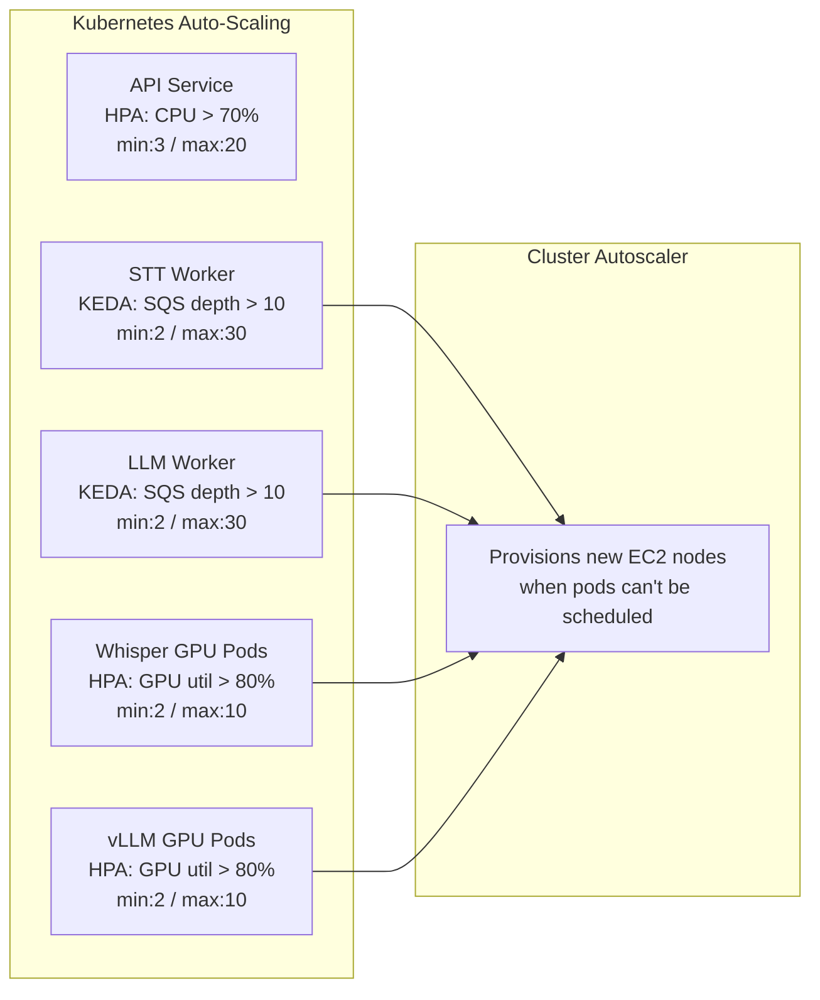

**Scaling layers:**

1. **KEDA** scales worker pods based on SQS `ApproximateNumberOfMessages`. When queue depth exceeds 10 messages, KEDA adds worker replicas to drain the queue faster. This is *proactive* — it reacts to demand before CPU spikes.
2. **HPA** scales API pods based on CPU utilization. Standard request-driven scaling.
3. **Cluster Autoscaler** provisions new EC2 nodes when pods are in `Pending` state (unschedulable). This handles GPU node scale-out — when KEDA adds more worker pods than existing GPU nodes can serve.
4. **Spot + On-Demand mix** for GPU nodes: base capacity on On-Demand for reliability, burst capacity on Spot for cost savings (up to 60% discount). The Cluster Autoscaler is configured with mixed instance policies.

#### Plug-in Task Extension (Phase 3)

```go
// TaskProcessor is the plug-in interface for extending the platform
// with new AI task types without modifying the core pipeline.
type TaskProcessor interface {
    ProcessTask(ctx context.Context, task *Task) (*TaskResult, error)
    QueueName() string
    TaskType() string
}

// ProcessorRegistry manages all registered task processors.
type ProcessorRegistry struct {
    processors map[string]TaskProcessor
}

func (r *ProcessorRegistry) Register(taskType string, p TaskProcessor) {
    r.processors[taskType] = p
}

// Example: adding sentiment analysis requires only:
// 1. Implement TaskProcessor interface
// 2. Register it
// 3. Create the SQS queue
// No changes to the worker engine, API, or existing processors.
registry.Register("stt", &STTProcessor{})
registry.Register("llm", &LLMProcessor{})
registry.Register("sentiment", &SentimentProcessor{})  // New capability
```

### 5.2 Fault Tolerance

#### Failure Scenarios and Mitigation

| Failure Scenario | Impact | Mitigation Strategy | Recovery Time |
|-----------------|--------|-------------------|---------------|
| **Worker crash mid-task** | Task appears stuck | SQS visibility timeout expires → message automatically redelivered to another worker | Visibility timeout (e.g., 5 min) |
| **Model server unresponsive** | Worker blocked on HTTP call | Timeout (30s) + exponential backoff retry (3 attempts) + circuit breaker | Immediate failover to retry |
| **Retry exhausted** | Task permanently failed | Message moves to DLQ → CloudWatch Alarm → PagerDuty alert → manual intervention | Minutes (alert) to hours (manual fix) |
| **RDS primary failure** | DB writes fail | Multi-AZ automatic failover (Phase 2+) | < 60 seconds |
| **Redis node failure** | Cache miss, degraded perf | Multi-AZ failover (Phase 2+); application falls back to DB on miss | < 30 seconds |
| **Entire AZ outage** | Partial capacity loss | EKS pods across multiple AZs; ALB routes around unhealthy AZ; Multi-AZ DB/cache | Seconds (automatic) |
| **API pod crash** | Request failures | K8s liveness/readiness probes auto-restart; ALB health checks remove unhealthy instances | < 30 seconds |
| **GPU node preemption (Spot)** | Processing capacity reduced | Cluster Autoscaler launches replacement; SQS redelivers in-flight messages | 2-5 minutes |

#### Key Fault Tolerance Mechanisms

- **SQS Visibility Timeout:** Set to 2x the maximum expected task processing time. For STT (up to 2 minutes for a 10-min audio file), set to 5 minutes. If a worker crashes, the message becomes visible again after this timeout and another worker picks it up.
- **Idempotent Processing:** Workers use Redis `SETNX` with a TTL to acquire a lock keyed by `task_id:stage`. If the lock exists, the message is ACKed without processing (deduplication). This prevents double-processing when SQS delivers a message twice.
- **Circuit Breaker:** Workers implement a circuit breaker pattern for model server calls. When the error rate exceeds 50% in a 30-second window, the circuit opens and requests fail fast for 60 seconds before half-opening. This prevents cascading failures when a model server is degraded.

### 5.3 Data Consistency

#### Write-then-ACK Pattern

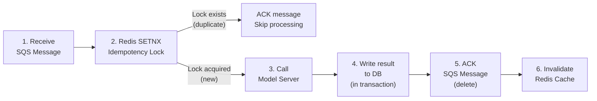

**Consistency guarantees:**

1. **Write-then-ACK:** The result is written to PostgreSQL *before* the SQS message is acknowledged (deleted). If the worker crashes after the DB write but before the ACK, the message is redelivered — but the idempotency lock prevents double-writing.

2. **Idempotent writes:** If the idempotency lock in Redis has expired (edge case: Redis restart between crash and redelivery), the worker checks the task's current status in the DB. If the status has already advanced past the expected state, the task is skipped.

3. **DB transactions:** Status update and result write happen in a single PostgreSQL transaction:
   ```
   BEGIN;
   UPDATE tasks SET status = 'llm_processing', transcript = $1, updated_at = NOW()
   WHERE id = $2 AND status = 'stt_processing';
   COMMIT;
   ```
   The `WHERE status = 'stt_processing'` clause acts as an optimistic lock — if another worker already processed this task, the UPDATE affects 0 rows and the worker knows to skip.

### 5.4 Latency & Performance

| Strategy | Description | Impact |
|----------|------------|--------|
| **Async Processing + WebSocket** | API returns task_id immediately (< 200ms). Optionally pushes real-time progress via WebSocket. | Users are never blocked waiting for GPU processing. |
| **API-Mediated Streaming Upload** | Clients upload audio to the API, which validates the stream and writes it to S3-compatible object storage. | Keeps content validation and auth checks in the server path while still avoiding full-buffer uploads. |
| **vLLM Continuous Batching** | vLLM dynamically batches multiple concurrent LLM requests. | 3-5x throughput improvement over naive sequential inference. |
| **Redis Result Cache** | Completed task results cached in Redis. | Query latency < 5ms on cache hit (vs. ~10-50ms DB query). |
| **Connection Pooling** | Go workers maintain persistent connection pools to DB, Redis, and model servers. | Eliminates per-request connection overhead. |
| **CloudFront CDN (Phase 3)** | Frontend static assets served from edge locations. | Sub-50ms page loads globally. |

#### Expected Latency

| Operation | Latency | Notes |
|-----------|---------|-------|
| Upload → receive task_id | < 200ms | API accepts request, writes to DB, enqueues to SQS |
| STT processing (1-min audio) | ~5-10 seconds | GPU inference time + overhead |
| LLM summarization | ~2-5 seconds | vLLM with continuous batching |
| **Total end-to-end (no queue wait)** | **~10-20 seconds** | Under low load |
| **Total end-to-end (with queue wait)** | **Seconds to minutes** | Depends on queue depth and GPU capacity |
| Query result (cache hit) | < 5ms | Redis GET |
| Query result (cache miss) | < 50ms | PostgreSQL SELECT with index |

### 5.5 Security

| Layer | Measure | Details |
|-------|---------|---------|
| **API Authentication** | JWT tokens (short-lived) + API Keys | JWT for user sessions, API keys for service-to-service. Unified validation via Echo middleware. |
| **S3 Access** | Private bucket via API-managed writes | Bucket policy denies all public access. Only the API/worker runtime can write/read objects. |
| **Transport Encryption** | End-to-end HTTPS/TLS | TLS 1.2+ terminated at ALB. Internal traffic encrypted in transit within VPC. |
| **At-rest Encryption** | S3 SSE-S3, RDS storage encryption | AES-256. Encryption enabled by default on all data stores. |
| **Network Isolation** | VPC private subnets | Model servers, databases, and Redis are in private subnets. Only the ALB is in a public subnet. Workers access model servers via private IPs. |
| **Rate Limiting** | Redis-based sliding window | 100 req/min per user at API layer. Prevents abuse and protects downstream services. |
| **File Validation** | MIME type + size check | Accept only audio MIME types (audio/wav, audio/mp3, etc.). Max file size: 500 MB. Reject before upload. |
| **Secrets Management** | AWS Secrets Manager | DB passwords, API keys, and model server credentials stored in Secrets Manager. Injected as environment variables via EKS CSI driver. Never in code or ConfigMaps. |

### 5.6 Observability

#### Observability Architecture (Phase 3)

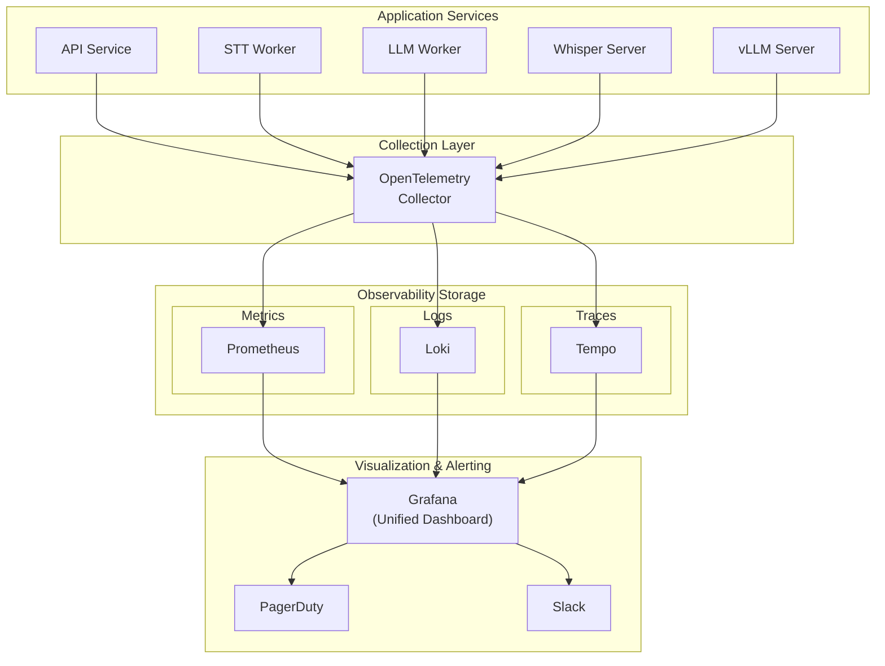

#### Observability Dimensions

| Dimension | Tool | Key Signals |
|-----------|------|-------------|
| **Metrics** | Prometheus + Grafana | Task processing rate (tasks/min), SQS queue depth, API P95/P99 latency, GPU utilization (%), error rate (%), cache hit ratio |
| **Logs** | Loki (structured JSON) | Per-task processing chain, error details with stack traces, model server response codes |
| **Traces** | OpenTelemetry + Tempo + Langfuse | Tempo handles system traces; Langfuse captures LLM prompts, model outputs, token usage, and eval metadata. |
| **Alerting** | Grafana Alerting → PagerDuty / Slack | DLQ message count > 0, error rate > 5%, P99 > threshold, GPU node count < minimum, queue depth growing for > 10 min |

**Task-level tracing:** Every task is assigned a `trace_id` at creation time. This trace_id propagates through SQS message attributes, worker logs, model server calls, and Langfuse spans. In Grafana and Langfuse, operators can inspect the full processing timeline: API request → queue wait time → STT inference → LLM inference → DB write, plus prompt version, token usage, and model response metadata.

---

## 6. Deployment & Operations

### 6.1 Deployment Topology

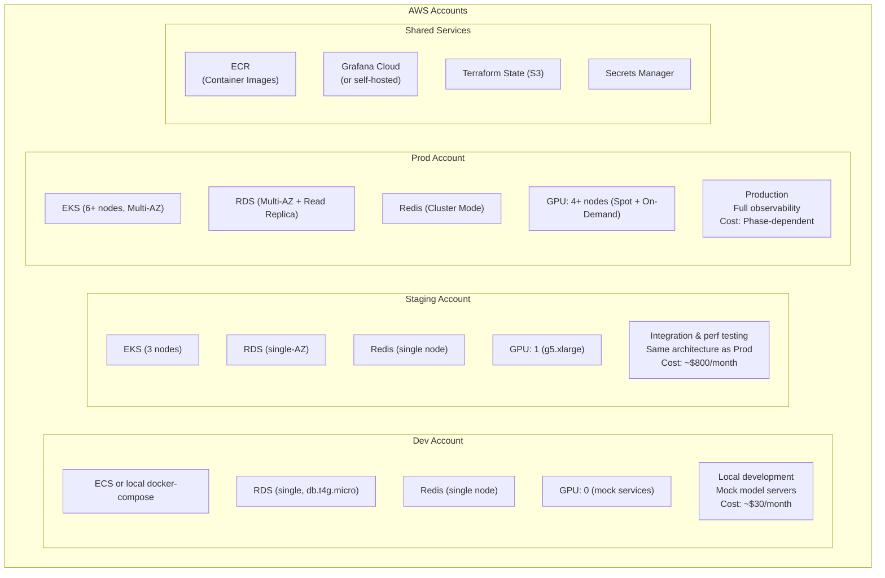

### 6.2 CI/CD Flow

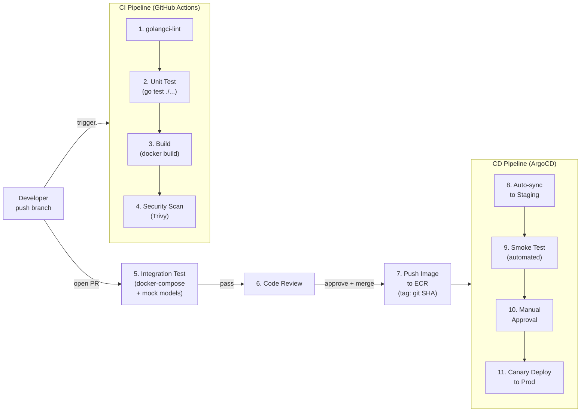

| Phase | Trigger | Actions |
|-------|---------|---------|
| **CI** | Push to any branch | Lint → unit test → docker build → security scan (Trivy) |
| **PR Check** | Open/update PR | Integration test (docker-compose with mock model servers) |
| **CD to Staging** | Merge to `main` | Auto-build image → push to ECR (tag: git SHA) → ArgoCD syncs to Staging |
| **CD to Prod** | Staging smoke tests pass | Manual approval → ArgoCD canary deployment to Prod |

### 6.3 Canary Deployment Strategy (Phase 3)

Uses **Argo Rollouts** for progressive traffic shifting with automatic metric-based promotion or rollback:

```mermaid
gantt
    title Canary Deployment Phases
    dateFormat X
    axisFormat %s

    section Traffic Split
    Phase 1 — 10% canary / 90% stable  :a1, 0, 5
    Phase 2 — 30% canary / 70% stable  :a2, 5, 10
    Phase 3 — 100% canary              :a3, 10, 15

    section Health Checks
    Monitor error rate < 1%             :crit, 0, 10
    Monitor P99 latency < threshold     :crit, 0, 10
    Auto-rollback if metrics degrade    :crit, 0, 10
```

**How it works:**
1. Argo Rollouts creates canary pods alongside stable pods.
2. The ALB Ingress gradually shifts traffic: 10% → 30% → 100%.
3. At each step, Argo queries Prometheus for error rate and P99 latency.
4. If metrics degrade beyond thresholds, traffic is automatically routed back to stable pods and canary pods are terminated.
5. No manual intervention required for rollback.

### 6.4 Rollback Strategy

| Scenario | Action | Impact |
|----------|--------|--------|
| **Canary metrics degrade** | Argo Rollouts automatically rolls back; zero manual intervention | No user impact (only 10-30% of traffic saw the canary) |
| **Post-release production issue** | `kubectl argo rollouts undo <rollout>` or revert via ArgoCD UI | Seconds to roll back to previous image |
| **DB migration issue** | Every migration has a corresponding `down` migration; run rollback | Requires coordination (migration must be backward-compatible) |
| **Emergency rollback** | ArgoCD syncs to a specific Git commit hash | Full rollback to known-good state |

### 6.5 Key Operational Principles

- **GitOps:** ArgoCD uses the Git repository as the single source of truth. All infrastructure changes go through PRs.
- **Immutable Image Tags:** Container images are tagged with Git SHA (`api:abc123f`), never `latest`. This ensures reproducible deployments and clean rollbacks.
- **Migration Separation:** Database migrations are executed as Kubernetes Jobs *before* the application deployment. Migrations must be backward-compatible (the old code version must still work with the new schema) to support canary deployments where old and new code coexist.

---

## 7. Architecture Decision Records

| # | Decision | Choice | Alternatives Considered | Rationale |
|---|----------|--------|------------------------|-----------|
| 1 | **Programming language** | Go (all services) | Go + Python mixed | Workers only make HTTP calls to model servers — no ML code. Go's concurrency model (goroutines), low memory, and single-binary deployment are ideal. No need for Python's ML ecosystem. |
| 2 | **Message queue** | Amazon SQS | Kafka, RabbitMQ | Task queue semantics (process once, delete). SQS is fully managed, zero ops, built-in DLQ, native KEDA scaler. Kafka is for event streaming (overkill). |
| 3 | **AI model hosting (Phase 1)** | AWS Transcribe + Bedrock | Self-hosted from day 1 | MVP priority is speed-to-market. Managed services have zero GPU ops overhead. Cost is acceptable below 50K tasks/month. |
| 4 | **AI model hosting (Phase 2+)** | Self-hosted faster-whisper + vLLM | Continue with managed services | Cost crossover at ~50K tasks/month. Self-hosted is 70%+ cheaper at scale. Full control over model version, quantization, batching. |
| 5 | **Container orchestration (Phase 1)** | ECS Fargate | EKS | No GPU needed in Phase 1. Fargate is simpler (no cluster management) and cheaper at low scale. |
| 6 | **Container orchestration (Phase 2+)** | Amazon EKS | ECS, self-managed K8s | GPU node group support, HPA/KEDA ecosystem, Argo Rollouts for canary. Industry standard. |
| 7 | **Deployment strategy** | Argo Rollouts (canary) | Blue-Green, Rolling | Progressive traffic shifting with automatic metric-based rollback. Lowest risk for user-facing changes. |
| 8 | **GitOps tool** | ArgoCD | Jenkins CD, FluxCD | Declarative, Git as single source of truth, easy rollback to any commit. Strong UI for visibility. |
| 9 | **Database** | RDS PostgreSQL | Aurora, DynamoDB | ACID for task state consistency. PostgreSQL is well-understood and sufficient. Aurora's 3x cost not justified. DynamoDB lacks relational queries needed for task management. |
| 10 | **Observability** | Prometheus + Grafana + Loki + Tempo | Datadog, New Relic | Open-source stack avoids per-host pricing that scales expensively with GPU nodes. Full control. Trade-off: higher ops burden. |

---

## 8. Project Structure

```
ai-processing-platform/
├── cmd/
│   ├── api/                    # API Service entry point
│   │   ├── main.go
│   │   └── Dockerfile
│   ├── stt-worker/             # STT Worker entry point
│   │   ├── main.go
│   │   └── Dockerfile
│   ├── llm-worker/             # LLM Worker entry point
│   │   ├── main.go
│   │   └── Dockerfile
│   ├── mock-stt/               # Mock Whisper server (local dev)
│   │   ├── main.go
│   │   └── Dockerfile
│   └── mock-llm/               # Mock vLLM server (local dev)
│       ├── main.go
│       └── Dockerfile
├── internal/
│   ├── config/                 # Environment config loading
│   │   └── config.go
│   ├── handler/                # HTTP handlers (Echo)
│   │   └── task_handler.go
│   ├── model/                  # Domain models
│   │   └── task.go
│   ├── queue/                  # Message queue abstraction
│   │   └── rabbitmq.go         # RabbitMQ (local) / SQS (prod)
│   └── repository/             # Database access layer
│       └── task_repo.go
├── migrations/
│   ├── 001_create_tasks.up.sql
│   └── 001_create_tasks.down.sql
├── docs/
│   └── plans/                  # Design & implementation plans
├── docker-compose.yml          # Local development stack
├── Makefile
├── go.mod
├── go.sum
├── ARCHITECTURE.md             # Architecture design (this file)
└── README.md                   # Quick start guide
```

---

## 9. Quick Start (Local Demo)

The local development environment runs the full pipeline with mock model servers (no GPU required).

### Prerequisites

- Docker and Docker Compose

### Start All Services

```bash
# Build and start all services (API, workers, mock models, infra)
docker compose up --build -d

# Verify all services are running
docker compose ps
```

### Create a Task

```bash
curl -s -X POST http://localhost:18080/api/v1/tasks \
  -H "Content-Type: application/json" \
  -d '{"audio_key": "uploads/test-audio-001.wav"}' | jq .
```

**Expected response:**
```json
{
  "id": "a1b2c3d4-e5f6-7890-abcd-ef1234567890",
  "status": "pending",
  "audio_key": "uploads/test-audio-001.wav",
  "created_at": "2026-03-03T12:00:00Z"
}
```

### Query Task Result

```bash
# Replace <task_id> with the UUID from the create response
curl -s http://localhost:18080/api/v1/tasks/<task_id> | jq .
```

### List All Tasks

```bash
curl -s http://localhost:18080/api/v1/tasks | jq .
```

### Stop Services

```bash
docker compose down
```

### Useful Links (Local Dev)

| Service | URL | Notes |
|---------|-----|-------|
| API Service | http://localhost:18080 | Main API endpoint |
| RabbitMQ Management | http://localhost:35672 | user: `app`, pass: `devpassword` |
| Mock STT Server | http://localhost:18081 | Simulates Whisper API |
| Mock LLM Server | http://localhost:18082 | Simulates vLLM API |
| PostgreSQL | localhost:15432 | user: `app`, pass: `devpassword`, db: `aiplatform` |
| Redis | localhost:16379 | No auth (local dev only) |
